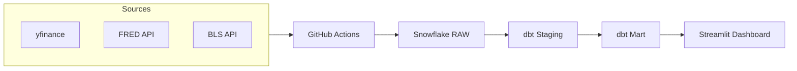
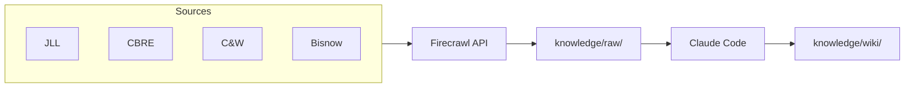
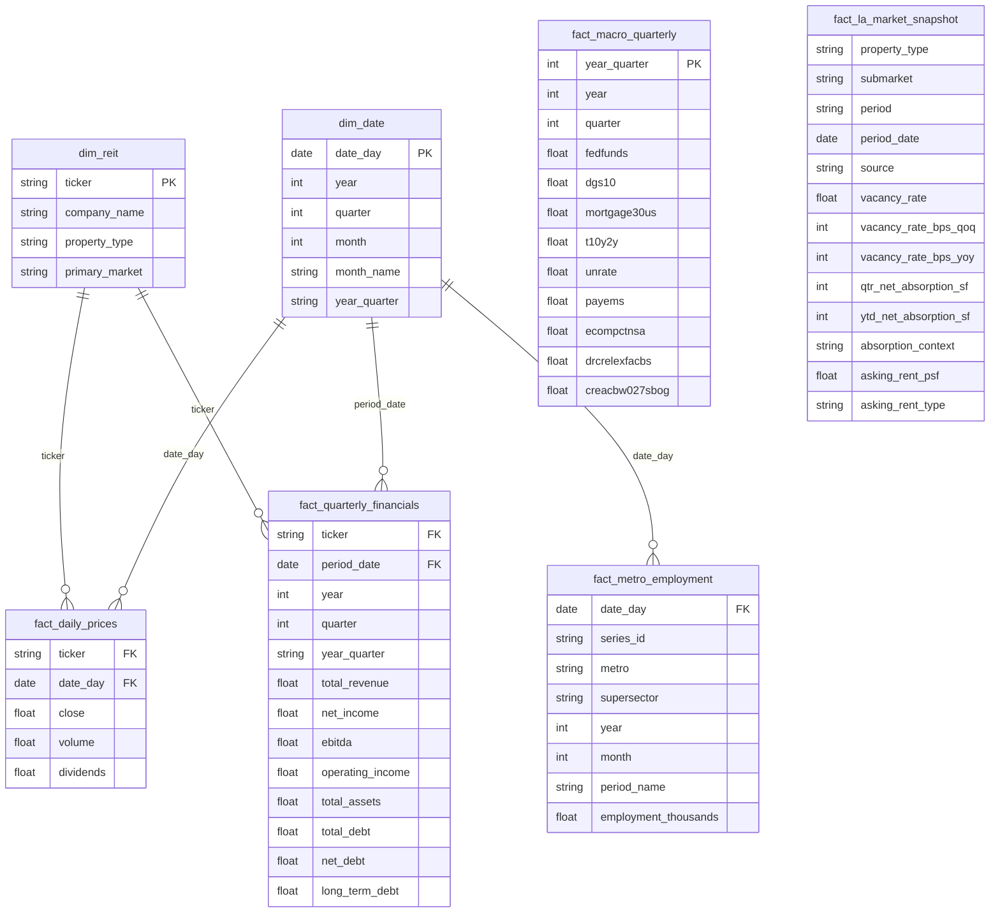

# LA Commercial Real Estate Analytics

An end-to-end data pipeline and analytics project targeting the JLL Business Intelligence Analyst role. Pulls REIT price and macro data from public APIs, transforms it through a Snowflake star schema via dbt, and surfaces occupancy, investment, and employment insights through an interactive Streamlit dashboard. Supplemented by a Claude Code-queryable knowledge base built from 24 scraped market reports across JLL, CBRE, Cushman & Wakefield, and Bisnow.

## Job Posting

- **Role:** Business Intelligence Analyst
- **Company:** JLL (Jones Lang LaSalle)
- **Location:** Rosemead, CA

This project demonstrates the posting's core requirements: SQL-driven descriptive and diagnostic analytics, ETL pipelines loading structured data to a cloud data warehouse, dimensional modeling with dbt, and delivering stakeholder-facing insights via an interactive dashboard.

## Tech Stack

| Layer | Tool |
|---|---|
| Source 1 | yfinance Python client — REIT daily prices + quarterly financials |
| Source 2 | FRED API — macroeconomic indicators (fed funds, delinquency, e-commerce) |
| Source 3 | BLS API — metro-level employment by sector |
| Source 4 | Firecrawl — CRE market reports (JLL, CBRE, Cushman & Wakefield, Bisnow) |
| Data Warehouse | Snowflake (AWS US East 1) |
| Transformation | dbt (staging views + mart star schema) |
| Orchestration | GitHub Actions (scheduled + manual trigger) |
| Dashboard | Streamlit (Streamlit Community Cloud) |
| Knowledge Base | Claude Code (scrape → synthesize → query) |

## Pipeline Diagram

**Structured Data Path**



**Knowledge Base Path**



## ERD (Star Schema)



## Dashboard Preview

*Screenshot — add after deployment*

## Key Insights

**Descriptive (what happened?):** LA office vacancy reached 24.1% in Q2 2025 — 12 consecutive quarters of negative net absorption — while industrial held at sub-5% vacancy and posted its first positive YTD absorption since 2022. JLL's Property Clock places LA in "Bottoming out" for both sectors as of Q4 2025.

**Diagnostic (why did it happen?):** The Fed raised rates from near zero to 5.3% in 18 months. Every incremental rate increase raised the cost to finance a building purchase and raised the cost to refinance existing debt. Office absorbed both hits simultaneously: remote work reduced tenant demand while rising rates reduced buyer demand. Industrial was insulated because e-commerce growth permanently raised warehouse demand regardless of borrowing costs.

**Recommendation:** LA leasing brokers should advise tenant clients to sign long-term office leases now → office landlords are offering the most aggressive concessions in a decade (free rent, large TI allowances, below-market rents) because they need cash flow to service debt on underwater assets. The window closes when rates fall enough to relieve landlord financial pressure.

## Live Dashboard

**URL:** https://commercial-real-estate-analytics.streamlit.app/

## Knowledge Base

A Claude Code-curated wiki built from 24 scraped sources across 4 firms (JLL, CBRE, Cushman & Wakefield, Bisnow). Wiki pages synthesize multiple sources rather than summarizing individual reports. Raw sources live in `knowledge/raw/`, synthesized pages in `knowledge/wiki/`. Browse `knowledge/index.md` for a full index with one-line descriptions and cross-references.

**Query it:** Open Claude Code in this repo and ask:

- "What does my knowledge base say about LA office vacancy trends?"
- "How does LA's office market compare to Dallas and New York?"
- "What sectors are analysts most bullish on for 2026?"
- "What's the investment thesis for distressed office in LA right now?"
- "How has e-commerce driven industrial demand?"

Claude Code reads wiki pages first and falls back to raw sources when needed. See `CLAUDE.md` for query conventions.

## Setup & Reproduction

**Prerequisites:** Python 3.11+, Snowflake trial account (AWS US East 1), FRED API key (free at fred.stlouisfed.org), Firecrawl API key (free tier at firecrawl.dev)

Create a `.env` file in the project root:

```
SNOWFLAKE_ACCOUNT=your_account
SNOWFLAKE_USER=your_user
SNOWFLAKE_PASSWORD=your_password
SNOWFLAKE_DATABASE=your_database
SNOWFLAKE_WAREHOUSE=your_warehouse
SNOWFLAKE_SCHEMA=ANALYTICS
FRED_API_KEY=your_fred_key
FIRECRAWL_API_KEY=your_firecrawl_key
```

Install dependencies:

```bash
pip install -r requirements.txt
```

Run extractors:

```bash
python extractors/reit_extract.py       # REIT daily prices + quarterly financials
python extractors/fred_extract.py       # FRED macro indicators
python extractors/bls_extract.py        # BLS metro employment
python extractors/scrape_extract.py     # Web scrape → knowledge/raw/
```

Run dbt transforms (requires your own Snowflake account and `.env` with credentials):

```bash
# Load .env into your shell first (required — dbt reads credentials from environment variables)
set -a && source .env && set +a

cd dbt/cre_analytics
dbt seed            # Load static MarketBeat data
dbt run             # Build staging + mart models
dbt test            # Validate data quality
```

> **Note:** The live dashboard at the public Streamlit URL connects to the project's Snowflake instance directly — no local setup needed to view results.

Run the dashboard locally:

```bash
streamlit run dashboard/app.py
```

## Repository Structure

```
.
├── .github/workflows/      # GitHub Actions pipelines (scheduled extraction)
├── extractors/             # API extractors (reit, fred, bls) + web scrape extractor (scrape)
├── dbt/cre_analytics/
│   ├── models/staging/     # Cleaning, type casting, renaming per source
│   ├── models/mart/        # Star schema: fact + dimension tables
│   └── seeds/              # Static MarketBeat data (la_marketbeat.csv)
├── dashboard/              # Streamlit app (app.py)
├── knowledge/
│   ├── raw/                # 24 scraped market reports
│   └── wiki/               # 9 Claude Code-generated synthesis pages
├── docs/                   # Proposal, job posting, specs, plans, slides
├── .gitignore
├── CLAUDE.md               # Project context for Claude Code
└── README.md               # This file
```
