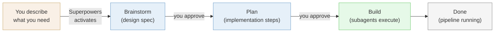
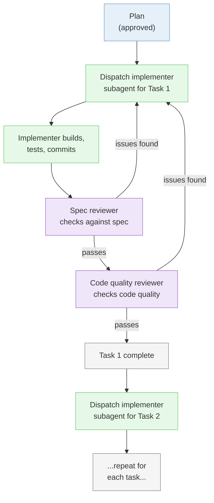
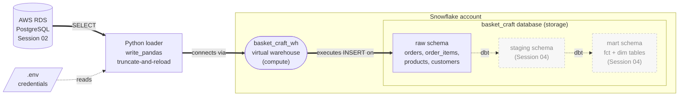
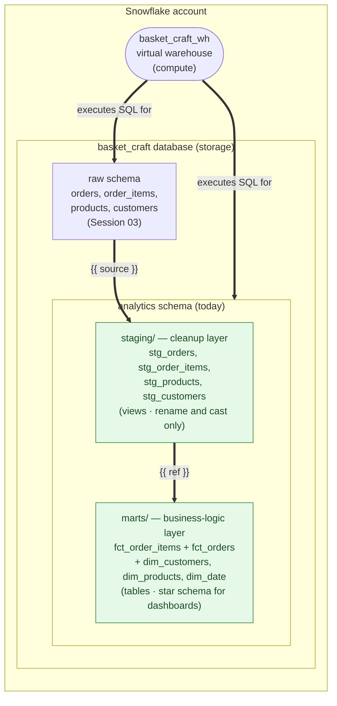
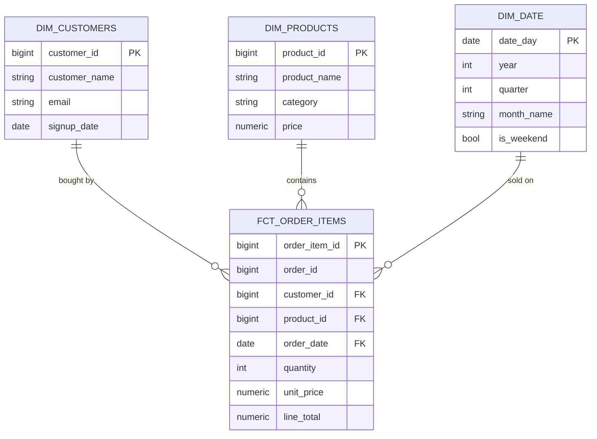
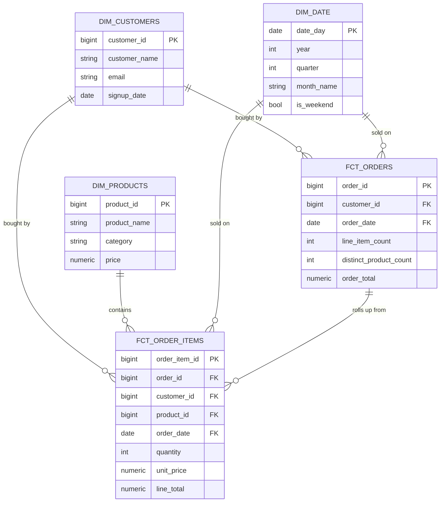

# Mini-Project 02: Cloud Extraction Pipeline Tutorial

This tutorial covers all four sessions of Mini-Project 02. If you fall behind during class, use this tutorial to catch up. Every command and prompt is written out so you can follow along on your own.

## Table of Contents

**Part 1: Extract and Load (Session 01)**

| Step | Topic | What You Will Do |
|------|-------|-----------------|
| 1 | [Create repo and start Claude Code](#step-1-create-github-repo-and-clone-into-cursor) | Set up the project repo, ensure Docker is running, start Claude Code |
| 2 | [Install Superpowers](#step-2-install-superpowers) | Add the Superpowers plugin to Claude Code |
| 3 | [Brainstorm the pipeline](#step-3-brainstorm-the-pipeline) | Design the pipeline with Superpowers brainstorming and a diagram |
| 4 | [Implement the pipeline](#step-4-implement-the-pipeline) | Set up CLAUDE.md, add credentials, let Superpowers build the pipeline |
| 5 | [Verify the data](#step-5-verify-the-loaded-data) | Check the results with psql, DBeaver, and Claude Code |
| 6 | [Update CLAUDE.md](#step-6-update-claudemd) | Run /init to capture the full project context |

**Part 2: Moving to the Cloud (Session 02)**

| Step | Topic | What You Will Do |
|------|-------|-----------------|
| 7 | [Verify AWS setup](#step-7-verify-aws-setup) | Confirm AWS CLI works, configure credentials |
| 8 | [Create RDS via Console](#step-8-create-rds-via-the-aws-console) | Build a cloud PostgreSQL database through the AWS web interface |
| 9 | [Recreate RDS via CLI](#step-9-delete-console-instance-recreate-via-cli) | Delete the Console instance, recreate with one CLI command |
| 10 | [Load raw data into RDS](#step-10-load-raw-data-into-aws-rds) | Extract all Basket Craft tables and load into cloud PostgreSQL |
| 11 | [Verify the data](#step-11-verify-the-loaded-data) | Check results with DBeaver and Claude Code |
| 12 | [Update documentation](#step-12-update-documentation-and-push) | Update CLAUDE.md, update README, commit and push |

**Part 3: Snowflake Load (Session 03)**

| Step | Topic | What You Will Do |
|------|-------|-----------------|
| Intro | [Concept primer (slides)](#concept-primer-slides) | Read the Session 03 slide deck before Step 13 |
| 13 | [Verify your Snowflake account](#step-13-verify-your-snowflake-account) | Log in, confirm region and edition, copy account identifier |
| 14 | [Create Snowflake objects](#step-14-create-snowflake-objects) | Build warehouse, database, and schema with one worksheet |
| 15 | [Store Snowflake credentials](#step-15-store-snowflake-credentials-in-env) | Add Snowflake variables to `.env`, confirm gitignored |
| 16 | [Brainstorm the loader](#step-16-brainstorm-the-rds-to-snowflake-loader) | Use Superpowers to design the RDS-to-Snowflake hop before writing code |
| 17 | [Implement the loader](#step-17-implement-the-loader) | Let Claude Code write the Python loader based on the plan |
| 18 | [Run and verify](#step-18-run-the-loader-and-verify) | Load all tables, confirm row counts match RDS |
| 19 | [Commit and push](#step-19-commit-push-and-update-claudemd) | Update CLAUDE.md, commit, push to GitHub |
| Recap | [Portfolio transfer](#portfolio-transfer-what-you-just-learned) | Map Session 03 skills onto your portfolio project requirements |

**Part 4: dbt Core and Star Schema (Session 04)**

| Step | Topic | What You Will Do |
|------|-------|-----------------|
| 20 | [Install dbt Core](#step-20-install-dbt-core) | Install `dbt-snowflake` and update requirements.txt |
| 21 | [Initialize the dbt project](#step-21-initialize-the-dbt-project) | Run `dbt init`, tour the folder structure |
| 22 | [Configure profiles.yml with env_var](#step-22-configure-profilesyml-with-env_var) | Wire dbt to Snowflake without committing secrets |
| 23 | [Declare raw tables as sources](#step-23-declare-the-raw-tables-as-dbt-sources) | Create `_sources.yml` for the four raw tables |
| 24 | [Build the staging layer](#step-24-build-the-staging-layer) | One staging model per source: rename and cast only |
| 25 | [Build the star](#step-25-build-the-star--fact-and-dimensions) | `fct_order_items` + `dim_customers` + `dim_products` + provided `dim_date` |
| 26 | [Add a dbt test](#step-26-add-a-dbt-test) | Declare unique + not_null on the fact table primary key |
| 27 | [Run dbt and verify](#step-27-run-dbt-and-verify-in-snowflake) | `dbt run`, `dbt test`, check results in Snowsight |
| 28 | [Generate the lineage graph](#step-28-generate-and-view-the-lineage-graph) | `dbt docs generate && dbt docs serve` |
| 29 | [Commit and push](#step-29-commit-push-and-update-claudemd-1) | Final commit, update CLAUDE.md, push |

---

## Part 1: Extract and Load (Session 01)

### Step 1: Create GitHub Repo and Clone into Cursor

In MP01, you built a project folder from scratch and added git later. This time you start the professional way: create the GitHub repository first, clone it to your machine, and then start building inside it.

**Why repo-first:** In professional work, you create the repository before writing any code so every change is tracked from the start. This is the workflow you will use for every project from now on.

You also need Docker running, since you will create a new local PostgreSQL container for this project.

**What to do:**

1. Go to [github.com/new](https://github.com/new) and create a new repository:
   - Name it `basket-craft-pipeline`
   - Set visibility to **Public**
   - Under **Add .gitignore**, select **Python** from the dropdown
   - Leave everything else as default (no README, no license)
   - Click **Create repository**

2. On your new repository's GitHub page, click the green **Code** button, make sure **HTTPS** is selected, and click the copy icon to copy the URL.

3. Clone the repo into Cursor. Open a new Cursor window and click **Clone repo** on the welcome screen. Paste the URL you just copied.

   If you do not see the welcome screen, you can also clone from the menu: **File > New Window**, then click **Clone repo**. Or use the command palette (Mac: `Cmd+Shift+P`, Windows: `Ctrl+Shift+P`) and search for "Git: Clone".

   When Cursor asks where to save it, navigate to your `isba-4715` folder inside your home directory (the same parent folder from MP01). Open the cloned folder when prompted.

   Your folder structure should now look like:
   ```
   ~/isba-4715/
   ├── campus-bites-pipeline/     <-- MP01
   └── basket-craft-pipeline/     <-- MP02 (this project)
   ```

4. Open a terminal in Cursor (`` Ctrl+` `` or **Terminal > New Terminal** from the menu bar).

5. Make sure Docker Desktop is open and running. If you do not have it installed (maybe you skipped MP01 or uninstalled it), follow the installation instructions in [MP01 Step 3](../06-local-pipeline/mp01-tutorial.md#step-3-install-docker) before continuing. It takes about 5 minutes.

   If your MP01 container (`campus_bites_db`) is running, stop it first. In Docker Desktop, go to **Containers**, find it, and click the Stop button. Or run `docker stop campus_bites_db` in your terminal. Two PostgreSQL containers cannot use the same port, and both default to 5432.

6. Confirm you are in the correct directory. Your terminal prompt should show `basket-craft-pipeline`. If not, navigate there and then start Claude Code:
   ```bash
   cd ~/isba-4715/basket-craft-pipeline
   claude
   ```
   Claude Code will ask if you trust this folder. Select **Yes, I trust this folder** and press Enter.

7. Set the output style to explanatory mode. Type:
   ```
   /config
   ```
   Use the arrow keys to select **Output style**, press Enter, then select **Explanatory** and press Enter again. This tells Claude Code to explain what it is doing as it works, so you learn the tools instead of just watching code appear. You only need to set this once. It persists across sessions.

**Checkpoint:** Your repo is cloned and open in Cursor. Docker Desktop is running. Claude Code is active in the terminal with explanatory output style.

---

### Step 2: Install Superpowers

In MP01, you used Claude Code with basic prompts: "do this," "build that." You described what you wanted and it generated the code. That works well for straightforward tasks.

But when you are building a pipeline with multiple moving parts (a source database, extraction scripts, transformations, a destination database), it helps to think through the design before writing code. [Superpowers](https://github.com/obra/superpowers) is a plugin for Claude Code that adds structured workflows for exactly this. The main one you will use today is brainstorming, which walks you through a design conversation and produces a blueprint before any code gets written.

**What to do:**

1. In your Claude Code session, install the Superpowers plugin. Type:

   ```
   /plugin install superpowers@claude-plugins-official
   ```

   Follow the prompts to complete the installation.

2. Once installed, verify that it worked by typing `/super` in the Claude Code prompt. You should see autocomplete suggestions that include Superpowers commands like `/using-superpowers`. If you see them, the install worked.

**Why this matters:** Superpowers adds structured skills to Claude Code that activate automatically. When you describe something you want to build, Superpowers will recognize the situation and start a **brainstorming** conversation before jumping to code. You do not need to type a special command. Just describe what you need and Claude Code will announce which skill it is using. The two skills we will learn in this course are:
- **Brainstorming:** Design before you build. Have a conversation about what you are trying to accomplish, and end up with a pipeline diagram and a plan. You will use this today.
- **Writing plans:** Break complex work into steps. You will learn this one in a later session.

Superpowers has many other skills (debugging, code review, testing, and more), but these two are the ones we will use in class.

In MP01, you told Claude Code *what* to build. With Superpowers, it first discusses *what and why* with you, then builds. Here is the full workflow:



You approve at two checkpoints (after the spec and after the plan), then Superpowers builds autonomously. Over the next few sessions, you will learn progressively more structured ways to work with Claude Code. Each one builds on the last.

**Checkpoint:** Superpowers is installed. You see Superpowers commands in the autocomplete when you type `/super`.

---

### Step 3: Brainstorm the Pipeline

Before writing any code, you are going to design the pipeline. In MP01 Step 5, you let Claude Code ask you questions to explore the problem. That was freeform. This time, Superpowers will automatically activate its brainstorming skill when it sees you describing something you want to build. Instead of jumping to code, Claude Code will start a structured design conversation that produces a **written design spec**, a document that gets saved to your project and committed to git. The spec defines everything needed to build the pipeline: architecture diagram, file structure and responsibilities, table schemas, SQL for aggregations, Docker and credential configuration, error handling, and testing strategy. Because the spec defines every file and its job, implementation in Step 4 is just executing the spec.

Here is the important part: **your design will probably look different from the instructor's and from your classmates'.** That is how real engineering works. Two people given the same business question will make different decisions about which tables to pull, how to aggregate, and how to structure the scripts. As long as your pipeline answers the business question, your design is valid.

**What to do:**

1. In Claude Code, type:

   ```
   I need to build a data pipeline. The Basket Craft team wants a
   monthly sales dashboard with revenue, order counts, and average
   order value by product category and month.

   Source: Basket Craft MySQL database.
   Destination: local PostgreSQL in Docker.

   Create a diagram of the pipeline, then help me plan
   the extraction and transformation.
   ```

   Claude Code will announce that it is using the brainstorming skill. This is Superpowers at work. It recognized that you are describing something you want to build and activated the right workflow automatically.

   Claude Code may also offer to open a **visual companion** in your browser for showing diagrams and mockups. If it asks, say yes and open the `localhost` URL it provides. If it does not offer, that is fine. The brainstorm will work in the terminal either way.

2. Claude Code will start a design conversation and ask about your setup. The brainstorm is a back-and-forth conversation, not a single prompt. Claude Code will ask you questions one at a time. Answer each one, and if it suggests something you do not understand, ask it to explain. A typical brainstorm takes 4-8 exchanges before producing the final diagram and plan.

   Be honest about your setup. If something from MP01 is broken or missing, tell the brainstorm. It will include fix-it steps in the pipeline design. That is one of the advantages of designing before building.

   Here is how to respond to common questions:

   - **When it asks about the source database:** Tell it the connection details you have been using all semester for the Basket Craft MySQL database. The credentials are the same ones from Lessons 01-05. The instructor will share them in the Zoom chat and the Teams channel.

   - **When it asks about the destination:** Tell it you need a local PostgreSQL database running in Docker for this project. The brainstorm will include a `docker-compose.yml` and container setup as part of the pipeline design. This is a new container separate from your MP01 project.

   - **When it asks about the transformation:** Explain that you need aggregated summary tables for a sales dashboard. Revenue, order counts, and average order value grouped by product category and month.

   - **When it asks about anything else:** Answer based on what you know. If you are unsure about something, say so. That is what the brainstorm is for.

3. The brainstorm will present the design in sections for you to review and approve. The final written spec will include:
   - A **pipeline diagram** (source -> extract -> transform -> load -> destination)
   - **File structure** and what each script is responsible for
   - **Table schemas** and SQL for aggregations
   - **Docker and credential configuration**
   - **Error handling** and **testing strategy**

   Review each section critically. If it misses something (for example, it only extracts one table when you need data from both orders and products to get category information), push back: "I think we also need the products table to get category names. Can you update the spec?" The brainstorm is a conversation, and you can steer it.

4. If the brainstorm has not yet produced a pipeline diagram, ask for one:

   ```
   Create a diagram of the pipeline we just designed.
   ```

5. Once you approve the final spec, Superpowers will write it to a file in your project (typically in a `docs/` folder) and commit it.

6. **Open the spec file in Cursor and read it.** This is the blueprint for your entire pipeline. Check that it makes sense to you:
   - Does the pipeline diagram match what you discussed?
   - Do the table schemas include the columns you expect?
   - Does the aggregation SQL produce the metrics the business question asks for (revenue, order counts, avg order value by category and month)?
   - Are the file names and responsibilities clear?

   If something looks wrong, tell Claude Code what to fix. The spec is easier to correct now than after the code is written. Once you are satisfied, Superpowers will transition to planning and implementation in Step 4.

**Your design vs. the instructor's:** The instructor will show their pipeline design during class. Your design may extract different tables, aggregate in a different order, or structure the scripts differently. The grading criteria is not "does it match the instructor's approach" but "does it answer the business question: monthly revenue, order counts, and average order value by product category?"

**Why this matters:** In MP01, the tutorial told you exactly what to build. That was appropriate for learning the tools. Now you are learning a harder skill: deciding what to build. The brainstorming conversation is practice for the design thinking you will need for your independent project and for real engineering work after graduation.

Superpowers may have already committed the spec for you. If not, commit and push now:

```
Commit all files and push to GitHub.
```

**Checkpoint:** You have a written design spec committed to your project and pushed to GitHub. It defines every file, schema, and configuration needed to build the pipeline. Superpowers is ready to transition into planning and building.

---

### Step 4: Implement the Pipeline

Your brainstorm produced a design spec. Now Superpowers will transition into planning and execution.

**Spec vs. plan:** The spec is *what* to build and why: the design decisions, schemas, architecture, and trade-offs. It is the agreement on what the system looks like when it is done. You wrote this during brainstorming. The plan is *how* to build it, step by step: the exact files to create, the exact code to write, the exact commands to run, in what order. A spec could be implemented many different ways. The plan picks one way and spells it out so precisely that someone (or an agent) with zero context could follow it mechanically.

Superpowers writes the implementation plan based on the approved spec, then builds using **subagent-driven development**. Instead of doing everything in one long conversation, Claude Code spawns fresh mini-agents (subagents) for each task:



Each subagent gets just the context it needs for its task, avoiding conversation history bloat. You will see messages like "Dispatching implementer for Task 1..." as it works through the plan. You will also see a **Base SHA** at the start, which is a git commit hash that Superpowers saves as a snapshot before building, so it can roll back if something goes wrong. You do not need to prompt for each piece. Just watch it work and answer questions if it asks.

Before it starts building, there are two things you need to set up manually.

**What to do:**

1. Create a `CLAUDE.md` file for your project. This is a file in your project root that Claude Code reads at the start of every session. It contains persistent instructions for this project, like project-level preferences that you set once instead of repeating yourself. Tell Claude Code:

   ```
   Create a CLAUDE.md file with this instruction:
   Use a Python virtual environment to manage dependencies.
   ```

   This tells Claude Code to create and use a virtual environment automatically when it installs packages or runs scripts. You can add more project conventions to this file later.

2. Create a `.env` file in your project root. Right-click the file explorer, select **New File**, name it `.env`, and paste the credentials block the instructor shares in Zoom chat / Teams. It should look something like:

   ```
   MYSQL_HOST=...
   MYSQL_PORT=3306
   MYSQL_USER=...
   MYSQL_PASSWORD=...
   MYSQL_DATABASE=basket_craft
   ```

   Confirm that `.env` is listed in your `.gitignore` (the Python template you selected when creating the repo should already include it). This keeps credentials out of GitHub.

3. Approve the plan and let Superpowers build. After the brainstorm spec is approved, Superpowers will present an implementation plan. Review it, then approve it. Claude Code will start building: writing extraction scripts, transformation scripts, Docker configuration, and installing dependencies based on the approved spec.

   Let it work. If it asks questions, answer them. If it hits an error (connection issues, missing packages), it will fix and retry.

4. While Superpowers builds, confirm Docker is ready. Docker Desktop should still be open from Step 1, and your MP01 container should be stopped so port 5432 is free.

**After the build completes, review what was built:**

5. **Verify credentials stayed out of the code.** Open the generated Python scripts in Cursor and look for the database password. It should not appear in any `.py` file, only in the `.env` file. If it does:

   ```
   Move the credentials out of the script and read from the .env file.
   ```

6. Review the generated code in Cursor. You should be able to identify:
   - How the extraction script connects to the MySQL database and which tables it pulls
   - The aggregation logic in the transformation: GROUP BY, SUM, COUNT, AVG
   - How data flows from extraction to transformation to loading into PostgreSQL

**Your file structure vs. your classmates':** Your brainstorm may have produced a different file structure than others. Some pipelines use one script for everything, others separate extraction, transformation, and loading into different files. What matters is that the pipeline extracts, transforms, and loads correctly.

**What you are really building:** The summary tables you produce have measures (revenue, order count, average order value) grouped by dimensions (product category, month). If that sounds like it has a formal name, it does. These are the building blocks of a star schema, the standard structure for data warehouses. You will learn the vocabulary (fact tables, dimension tables, staging, marts) in Session 04 with dbt. For now, just notice the pattern: measures grouped by dimensions.

Superpowers may have already committed during the build. If not, commit and push now:

```
Commit all files and push to GitHub.
```

**Checkpoint:** The pipeline has been built and run. Extraction pulled data from the Basket Craft MySQL database, transformation aggregated it, and loading put the summary tables into your local PostgreSQL. Claude Code confirms success with row counts or a summary. Your work is pushed to GitHub.

---

### Step 5: Verify the Loaded Data

The pipeline ran. But did it work correctly? You will check the loaded data three different ways. Each catches different kinds of problems.

**What to do:**

**Method 1: psql via Claude Code**

1. Ask Claude Code to connect to your local PostgreSQL and check the data:

   ```
   Connect to my local PostgreSQL using psql. Show me the tables,
   row counts, and a sample of rows from each table.
   ```

2. Review the output. Do the table names match what your brainstorm planned? Do the row counts seem reasonable for monthly aggregations?

**CLI through Claude Code:** Claude Code can run CLI tools like `psql` on your behalf. You ask a question, and it handles the connection, the SQL, and the output formatting. You do not need to memorize psql commands. You will use this same pattern with the AWS CLI, dbt, and Snowflake CLI in later mini-projects.

**Method 2: DBeaver**

1. Open DBeaver and create a new PostgreSQL connection. Click **New Database Connection** (or **Database > New Database Connection**), select **PostgreSQL**, and fill in the connection details from the `docker-compose.yml` that the brainstorm created in your project folder:
   - Host: `localhost`
   - Port, database name, username, and password: check your `docker-compose.yml`
   - Click **Test Connection** to verify, then **Finish**

   This is a different connection from MP01. This project has its own container with its own credentials.

2. Navigate to your database > **Schemas > public > Tables**. You should see the summary tables that your pipeline created.

3. Double-click a table to browse the data. Do the numbers look reasonable? If you see monthly revenue in the hundreds of thousands, does that match your intuition about Basket Craft's order volume?

**Method 3: Claude Code natural language queries**

1. Back in Claude Code, ask analytical questions about the loaded data:

   ```
   What product category had the highest total revenue? Which month had the most orders?
   ```

2. Compare the answers to what you see in DBeaver. They should match.

3. Try a question that directly tests the business requirement:

   ```
   Show me the average order value by product category for each month, sorted by month.
   ```

   This is the core of what the Basket Craft team asked for. If this query returns sensible results, your pipeline works. Notice the structure of what you built: numerical measures (revenue, order count, average order value) organized by descriptive categories (product category, month). This pattern has a name you will learn in Session 04.

**Three tools, three purposes:**

| Tool | Best for | When to use |
|------|----------|-------------|
| psql via Claude Code | Quick checks, row counts, schema inspection | First pass: did the tables get created with the right structure? |
| DBeaver | Browsing data visually, spotting obvious issues | Second pass: does the data look right when you eyeball it? |
| Claude Code natural language | Analytical questions, testing the business logic | Final pass: does the pipeline actually answer the business question? |

You used all three of these in MP01. The workflow is the same here, just with different data. Get comfortable switching between them. You will use the same approach in your independent project.

**Commit your work.** Now that the pipeline is verified, commit everything. Ask Claude Code:

```
Commit all project files and push to GitHub.
```

**Checkpoint:** The aggregated data is verified through all three methods. You can see monthly revenue, order counts, and average order value by product category. The pipeline answers the business question the Basket Craft team asked for. Your work is committed to git.

---

### Step 6: Update CLAUDE.md

In Step 4, you created a `CLAUDE.md` with a single instruction about virtual environments. Now that the pipeline is fully built, update it to capture the full project context. This way, the next time you (or anyone) starts Claude Code in this project, it will already know what the project is, how it is structured, and how to work with it.

**What to do:**

1. In Claude Code, type:

   ```
   /init
   ```

   This tells Claude Code to scan your project and update the `CLAUDE.md` file. It will look at your scripts, Docker config, database setup, and directory structure to build a complete project summary.

2. Open `CLAUDE.md` in Cursor and review what it generated. It should include the project purpose, file descriptions, database connection details, and how to run the pipeline.

3. Create a `README.md` for your project. Tell Claude Code:

   ```
   Create a README.md that explains what this project is, how to
   set it up, and how to run the pipeline.
   ```

   A good README means anyone who visits your GitHub repo can understand what they are looking at. This is the first thing recruiters and collaborators see.

4. Commit and push:

   ```
   Commit all files and push to GitHub.
   ```

**Why this matters:** A good `CLAUDE.md` saves you time in every future session. Instead of re-explaining your project, Claude Code reads the file and picks up where you left off. This is especially useful in Sessions 02, 03, and 04, where you will build on top of what you built today.

**Checkpoint:** Your `CLAUDE.md` reflects the full project and your `README.md` explains the project to anyone visiting the repo. Both are committed and pushed to GitHub.

---

## Homework: Prepare for Session 02

Before the next class, complete these two setup tasks. You will need both for Session 02, where you set up your own AWS infrastructure.

1. **Create an AWS account.** Go to [aws.amazon.com](https://aws.amazon.com/) and create a free-tier account. You will need a credit card on file, but we will only use free-tier resources in this course. If you already have an AWS account from another class, you are set.

2. **Install the AWS CLI.** Follow the instructions for your operating system:

   **Mac:**
   ```bash
   brew install awscli
   ```

   **Windows:** Download and run the installer from [aws.amazon.com/cli](https://aws.amazon.com/cli/)

   Verify the installation by running:
   ```bash
   aws --version
   ```

   You should see a version number like `aws-cli/2.x.x`.

These tools are prerequisites for Session 02. We cannot proceed without them, so do not wait until the day of class.

---

## Part 2: Moving to the Cloud (Session 02)

In Session 01, your database ran in a Docker container on your laptop. That is fine for development, but production data lives in the cloud. AWS (Amazon Web Services) is the most widely used cloud platform. Most companies you will work for use AWS, Azure, or Google Cloud to run their databases and pipelines.

In this session, you will create an AWS RDS (Relational Database Service) instance. RDS is a managed PostgreSQL database: same SQL you already know, but AWS handles the server, storage, and backups. You just connect and use it. Everything we do today is covered by the AWS free tier.

### Step 7: Verify AWS Setup

Session 02 picks up in the same `basket-craft-pipeline` project from Session 01. Before building anything in the cloud, confirm the AWS tools from homework are working.

**What to do:**

1. Open your `basket-craft-pipeline` project in Cursor (the same repo from Session 01).

2. Open a terminal (`` Ctrl+` `` or **Terminal > New Terminal**).

3. Check that the AWS CLI is installed:
   ```bash
   aws --version
   ```
   You should see `aws-cli/2.x.x`. If not, install it now. Mac: `brew install awscli`, Windows: download from [aws.amazon.com/cli](https://aws.amazon.com/cli/).

4. Configure your AWS credentials:
   ```bash
   aws configure
   ```
   Enter your AWS Access Key ID and Secret Access Key when prompted. For region, enter `us-east-1`. For output format, enter `json`.

   If you do not have an access key, log in to the AWS Console at [console.aws.amazon.com](https://console.aws.amazon.com/), go to **IAM > Users > your user > Security credentials > Create access key**.

5. Confirm your credentials work:
   ```bash
   aws sts get-caller-identity
   ```
   You should see your AWS account ID, user ARN, and user ID returned as JSON. If the output opens in a pager (you see a `:` at the bottom of the screen), press `q` to exit.

6. Now start Claude Code:
   ```bash
   claude
   ```
   Trust the folder if prompted.

**AWS credentials vs project credentials:** This project uses two separate sets of credentials. AWS credentials (access key and secret key) are stored in `~/.aws/credentials` by `aws configure`. They live at the machine level. They identify you to AWS and never belong in your project files. RDS database credentials (username and password for your cloud database) go in your project's `.env` file, the same as the MySQL credentials from Session 01. Never put AWS access keys in `.env` or any file tracked by git.

**Checkpoint:** `aws sts get-caller-identity` returns your AWS account info. Claude Code is running in your `basket-craft-pipeline` project.

---

### Step 8: Create RDS via the AWS Console

You are going to create a cloud database two ways. First through the AWS Console (the web interface) so you understand what every setting does. Then in Step 9, you will delete it and recreate the same thing with one CLI command. The Console creation is deliberately slow. The point is to feel the friction so the CLI speed hits harder.

**What to do:**

1. Open the AWS Console in your browser: [console.aws.amazon.com](https://console.aws.amazon.com/). Sign in with your AWS account.

2. Navigate to **RDS**: search for "RDS" in the top search bar, or find it under **Services > Database > RDS**.

3. In the left sidebar, click **Databases**. Then click **Create database** in the top right.

4. Under **Choose a database creation method**, make sure **Full configuration** is selected (not Easy create). Full configuration shows every setting so you can see what goes into creating a cloud database. That is the point of this step.

5. Configure the new database. The page has a lot of settings. Work through these sections from top to bottom (leave anything not listed as default):

   **Engine options:**
   - Select **PostgreSQL** (not Aurora PostgreSQL Compatible). Look for the PostgreSQL elephant icon.

   **Templates:**
   - Select **Free tier** (the third option). This auto-configures instance size and storage to stay within the free tier.

   **Settings:**
   - **DB instance identifier:** `basket-craft-console`
   - **Master username:** `student`
   - **Credential management:** select **Self managed**
   - **Master password:** `go_lions` (confirm it)

   **Instance configuration:**
   - Free tier should have pre-selected a burstable instance class (db.t3.micro or db.t4g.micro). Leave it.

   **Storage:**
   - Free tier should have set this to 20 GB. If it shows a larger number, change it to `20`.

   **Connectivity:**
   - **Compute resource:** leave as **Don't connect to an EC2 compute resource**
   - **Public access:** select **Yes**
   - **VPC security group:** select **Create new** and name it `basket-craft-sg`

   **Additional configuration** (expand this section near the bottom of the page):
   - **Initial database name:** `basket_craft`. If you skip this, the database won't exist and DBeaver won't be able to connect.

6. Click **Create database**. Provisioning takes 5-10 minutes.

7. While the instance is provisioning, edit the security group to allow connections. You can do this now because the security group was created immediately.
   - Click on the instance name and go to the **Connectivity & security** tab
   - Under **Security group rules**, click on the security group you created (`basket-craft-sg`)
   - Click the **Security group ID** link to open it
   - Go to **Inbound rules > Edit inbound rules**
   - Change the **Source type** dropdown to **Anywhere-IPv4**. The **Source** field will update to `0.0.0.0/0`
   - Click **Save rules**

   `0.0.0.0/0` is a CIDR block that means "any IP address." It allows connections from anywhere: campus, home, a coffee shop. For a free-tier learning database this is fine. In production you would restrict this to specific IP addresses.

8. Once the status shows **Available**, go to the **Connectivity & security** tab and copy the **Endpoint** (it looks like `basket-craft-console.xxxx.us-east-1.rds.amazonaws.com`).

9. Open DBeaver and create a new PostgreSQL connection:
   - Host: paste the endpoint you copied
   - Port: `5432`
   - Database: `basket_craft`
   - Username: `student`
   - Password: `go_lions`
   - Click **Test Connection** to verify, then **Finish**

10. You should see an empty `basket_craft` database. This is a PostgreSQL database running in the cloud, not on your laptop.

**Not for production:** Public access and an open security group (0.0.0.0/0) are fine for a free-tier learning database. In production, you would restrict access to specific IP addresses or use a VPN. We are keeping it simple so you can connect from campus, home, or anywhere.

**Checkpoint:** Connected to the Console-created RDS instance (`basket-craft-console`) in DBeaver. Empty database, accessible from your machine.

---

### Step 9: Delete Console Instance, Recreate via CLI

That took a while. Every dropdown, every setting, the provisioning wait. Now you are going to do the same thing with one command. Once AWS knows who you are (`aws configure`), Claude Code can create, modify, and delete cloud resources on your behalf.

**What to do:**

1. In Claude Code, delete the Console-created instance:

   ```
   Delete my AWS RDS instance called basket-craft-console.
   Skip the final snapshot.
   ```

2. Go back to the RDS Console in your browser and confirm the `basket-craft-console` instance is being deleted or has been deleted. You should see its status change to **Deleting**.

3. Now create a new one with the same settings:

   ```
   Create an AWS RDS PostgreSQL instance with these settings:
   - Instance identifier: basket-craft-db
   - Database name: basket_craft
   - Master username: student
   - Master password: go_lions
   - Free tier eligible instance class
   - Storage: 20 GB
   - Publicly accessible: yes
   - Security group: basket-craft-sg
   ```

4. Wait for the instance to become available. This is another provisioning wait, but notice the difference: the Console required your attention for every field. The CLI required one prompt. You are already done.

   Ask Claude Code to check the status:

   ```
   Check if my basket-craft-db RDS instance is available yet.
   ```

5. Once available, get the endpoint:

   ```
   What is the endpoint for my basket-craft-db RDS instance?
   ```

6. Open DBeaver, create a new PostgreSQL connection using the new endpoint (same credentials: `student` / `go_lions`, database `basket_craft`). Test the connection.

**Why CLI matters:** The Console is good for learning what settings exist. The CLI is good for everything else: faster, repeatable, scriptable, and auditable. You will use CLIs for most cloud operations from here on.

**Checkpoint:** Console instance deleted. CLI-created instance (`basket-craft-db`) is running and connected in DBeaver.

---

### Step 10: Load Raw Data into AWS RDS

You have a cloud database. Now fill it with data. You will extract all raw Basket Craft tables from the instructor's MySQL database and load them into your AWS RDS PostgreSQL. Same source as Session 01, different destination.

**What to do:**

1. Add your RDS credentials to the `.env` file. Open it in Cursor and add these lines (keep the existing MySQL credentials):

   ```
   RDS_HOST=basket-craft-db.xxxx.us-east-1.rds.amazonaws.com
   RDS_PORT=5432
   RDS_USER=student
   RDS_PASSWORD=go_lions
   RDS_DATABASE=basket_craft
   ```

   Replace the `RDS_HOST` value with your actual endpoint from Step 9.

2. Tell Claude Code to load the data:

   ```
   Extract all raw tables from the Basket Craft MySQL database and
   load them into my AWS RDS PostgreSQL. Read the MySQL and RDS
   credentials from the .env file. Load all tables as-is, no
   transformations, just raw data.
   ```

3. Let Claude Code work. It will adapt your existing extraction scripts or write new ones. If it asks questions, answer them. If it hits connection errors, let it fix and retry.

**Superpowers may brainstorm again.** Even though this task is straightforward, Superpowers may activate the brainstorming skill because it detects you are building something. That is fine. The brainstorm will be shorter than Session 01 since the task is simpler (same source, new destination, no design decisions). Let it work through its process.

**Raw data for a reason:** You are loading raw, untransformed data. In Session 04, dbt will transform this into a star schema (fact and dimension tables). Raw data goes in first, transformations happen in the warehouse. That is the ELT pattern. Loading raw now means you have the full source to work with later.

**Checkpoint:** All 8 raw Basket Craft tables are loaded into the AWS RDS. Row counts per table match the source MySQL database.

---

### Step 11: Verify the Loaded Data

Check the data before calling it done. This time the database is remote.

**What to do:**

**Method 1: Claude Code**

1. Ask Claude Code to check the data:

   ```
   Connect to my AWS RDS PostgreSQL and show me all tables
   with their row counts.
   ```

2. Compare the row counts to what you expect from the source MySQL database.

**Method 2: DBeaver**

1. In DBeaver, refresh your connection to the `basket-craft-db` instance (right-click > **Refresh**).

2. Navigate to **basket_craft > Schemas** and expand the schemas. Your 8 tables will be under `public` (the PostgreSQL default) or under another schema that Claude Code created during the load (for example, `raw`). Open whichever schema contains them.

3. Open a few tables and browse the data. Does it look like the same Basket Craft data you queried in Lessons 01-05?

**Method 3: Claude Code natural language queries**

1. Ask an analytical question about the data in your RDS:

   ```
   Using my AWS RDS, what are the top 5 products by total revenue?
   ```

2. Compare the answer to what you would expect from the source data.

**Same three tools, same reasons:**

| Tool | What to check | Why |
|------|---------------|-----|
| Claude Code | Row counts per table | Quick programmatic check: did all 8 tables load? |
| DBeaver | Browse rows visually | Spot-check: does the data look right? |
| Claude Code (natural language) | Analytical question | Business check: do the numbers make sense? |

**Checkpoint:** Data verified. All 8 tables present in the AWS RDS with row counts matching the source MySQL database.

---

### Step 12: Update Documentation and Push

The pipeline works. Your data is in the cloud. Update your project documentation to reflect what you built. After every implementation session, update `CLAUDE.md` and the README.

**What to do:**

1. Ask Claude Code to update `CLAUDE.md`:

   ```
   Update CLAUDE.md to document the new AWS RDS database and
   the load scripts. Keep the existing instructions (like the
   virtual environment rule) as they are.
   ```

2. Review the updated `CLAUDE.md` in Cursor. It should now mention both the local Docker PostgreSQL (from Session 01) and the AWS RDS you just created. Check that it has the RDS endpoint, database name, and how to connect.

3. Update the README:

   ```
   Update the README.md to reflect that the project now includes
   an AWS RDS PostgreSQL database with raw Basket Craft data.
   ```

4. Commit and push:

   ```
   Commit all files and push to GitHub.
   ```

**Why documentation matters:** Every time you add infrastructure or change how the project works, update the docs. Your future self, your classmates, and recruiters looking at your GitHub will thank you. A repo with outdated docs is worse than a repo with no docs, because at least no docs is honest.

**Checkpoint:** CLAUDE.md reflects the AWS RDS addition. README is updated. All work is committed and pushed to GitHub.

---

## Homework: Prepare for Session 03

Sign up for a Snowflake trial account before the next class. This same account will also power your portfolio project, so read the timing note at the bottom before you click anything.

1. Go to [signup.snowflake.com](https://signup.snowflake.com/) and fill in the signup form. You only need a valid email address. No credit card required. The trial lasts 30 days and gives you $400 of free credits.

2. **Before clicking Sign up**, look below the Sign up button. You will see the current edition, cloud provider, and region. Click the `>` arrow to change these settings:
   - **Edition:** Standard (not Enterprise, to stretch your free credits)
   - **Cloud provider:** Amazon Web Services
   - **Region:** US East (Northern Virginia) (same region as your AWS RDS)

3. After signing up, log in and confirm you can see Snowsight, the Snowflake web interface.

This is required for Session 03. We cannot proceed without it.

**Timing, read this.** The trial is 30 days from signup. If you sign up on April 8, 2026, it expires May 8, 2026, three days before the May 11 final interview. You have two options:

- **Option A (recommended):** Use the same trial account for MP02 and your portfolio. Be conservative with warehouse runtime (auto-suspend is your friend). If credits run low near May 11, create a second trial account with a different email a week before the interview as backup.
- **Option B:** Sign up now for MP02, then create a second trial account with a different email when you start Milestone 01 around April 13-14. The fresh trial will easily survive past May 11.

Either works. Option A is simpler if you monitor credits. Option B doubles your free runtime at the cost of managing two accounts.

---

## Part 3: Snowflake Load (Session 03)

In Session 02 you landed the Basket Craft raw tables in a cloud PostgreSQL database on AWS RDS. Today you move that same data one more hop — into a cloud data warehouse, Snowflake. You will not transform anything yet. Today is the **L** in ELT: extract from RDS, load into Snowflake raw. Next session is the **T**, where dbt takes over.

**Before this session:** Complete the [homework from Session 02](#homework-prepare-for-session-03) (Snowflake trial account signup). You should be able to log in to Snowsight, the Snowflake web UI, before class starts.

**To start:** Open your `basket-craft-pipeline` project in Cursor — the same repo from Sessions 01 and 02. Open a terminal in Cursor and confirm `git status` shows a clean working tree before you begin.

### Concept primer (slides)

Before you touch Snowflake, read the slide deck for Session 03 (about five minutes):

**[Session 03 slides](https://lmu-isba.github.io/isba-4715-f26/lessons/07-cloud-pipeline/slides-session-03.html)**

The slides cover what Snowflake is, why storage and compute are separate, how managed ELT tools (Fivetran, Airbyte, Stitch, Hevo, Matillion) compare to a custom Python loader, and the pipeline you are about to build. Reading them now saves you confusion in Step 13 and in Session 04.

**Here is the pipeline you are about to build, and where it fits:**



Today's work follows the solid arrows: the Python loader reads Basket Craft rows out of RDS with `SELECT`, connects to the `basket_craft_wh` warehouse, and the warehouse executes `INSERT` into the `raw` schema. Inside the Snowflake account, the warehouse (compute) and the database (storage) are **separate account-level objects that sit side by side**. The same warehouse could write to a different database later, and the same database could be queried by a different warehouse. Every query or write you run in Snowflake travels through a warehouse on its way to (or from) a schema. The dashed `staging` and `mart` schemas are Session 04's job; dbt will read from `raw` and build them.

---

### Step 13: Verify Your Snowflake Account

Before we touch any code, confirm your Snowflake trial is set up correctly. Getting the region or edition wrong now will cause confusing failures later.

**What to do:**

1. Open a browser and go to [app.snowflake.com](https://app.snowflake.com). Log in with the account you created for homework.

2. Once logged in, look at the URL bar. It will look like `app.snowflake.com/us-east-1/XXXXXXX/...`. The `us-east-1` confirms you are in the same AWS region as your RDS database. If you see a different region, stop and message the instructor. We cannot proceed across regions.

3. In the left sidebar, click **Admin** > **Accounts**. Confirm your edition reads **Standard** (not Enterprise). Standard gives you more free credits to work with during the trial.

**Why this matters:** The region has to match your RDS region so your raw data does not cross regions (which is slow and, in production, expensive). You will grab your Snowflake account identifier directly into `.env` in Step 15, so there is nothing to jot down now.

**Checkpoint:** You can log in to Snowsight, your region is `us-east-1`, and your edition is Standard.

---

### Step 14: Create Snowflake Objects

Snowflake separates four concepts that other databases bundle together: **warehouses** (compute), **databases** (storage containers), **schemas** (namespaces inside a database), and **roles** (access control). You will create one of each for this project.

**Database vs. schema, why two levels?** Think of the database as a folder and the schema as a sub-folder inside it. You will put raw Basket Craft data in a `raw` schema today; in Session 04, dbt adds `staging` and `mart` schemas inside the same `basket_craft` database, so messy source tables and cleaned star-schema tables never share a namespace.

In Snowsight, the tool for running SQL is a **SQL file** (older Snowflake docs and screenshots call it a "worksheet" — same thing). Think of it like a query editor in DBeaver: you paste SQL, hit run, and see results.

**What to do:**

1. In Snowsight, click the **+** button in the top-left (the hover label reads "Create") and choose **SQL File** from the menu. A new SQL file opens in the editor.

2. Paste the following SQL into the editor. Do not run it yet — read through the comments first so you understand what each statement does.

   ```sql
   -- Use the account admin role so we have permission to create objects
   USE ROLE ACCOUNTADMIN;

   -- Create a virtual warehouse (compute) for this project.
   -- XS is the smallest size. Auto-suspend after 60s idle to save credits.
   CREATE WAREHOUSE IF NOT EXISTS basket_craft_wh
       WAREHOUSE_SIZE = 'XSMALL'
       AUTO_SUSPEND = 60
       AUTO_RESUME = TRUE
       INITIALLY_SUSPENDED = TRUE;

   -- Create a database to hold all Basket Craft data
   CREATE DATABASE IF NOT EXISTS basket_craft;

   -- Create a schema called "raw" for the untransformed data
   CREATE SCHEMA IF NOT EXISTS basket_craft.raw;

   -- Create a least-privilege role for the Python loader to use at runtime.
   -- ACCOUNTADMIN stays reserved for one-time admin tasks like this worksheet.
   CREATE ROLE IF NOT EXISTS basket_craft_loader;

   -- Grant the loader role exactly what it needs: use the warehouse, work in the
   -- database, and read/write in the raw schema (current and future tables).
   GRANT USAGE ON WAREHOUSE basket_craft_wh TO ROLE basket_craft_loader;
   GRANT USAGE ON DATABASE basket_craft TO ROLE basket_craft_loader;
   GRANT USAGE ON SCHEMA basket_craft.raw TO ROLE basket_craft_loader;
   GRANT CREATE TABLE ON SCHEMA basket_craft.raw TO ROLE basket_craft_loader;
   GRANT SELECT, INSERT, UPDATE, DELETE, TRUNCATE ON ALL TABLES IN SCHEMA basket_craft.raw TO ROLE basket_craft_loader;
   GRANT SELECT, INSERT, UPDATE, DELETE, TRUNCATE ON FUTURE TABLES IN SCHEMA basket_craft.raw TO ROLE basket_craft_loader;

   -- Let your own Snowflake user assume this new role.
   SET my_user = CURRENT_USER();
   GRANT ROLE basket_craft_loader TO USER IDENTIFIER($my_user);

   -- Switch to the new warehouse, database, and schema
   USE WAREHOUSE basket_craft_wh;
   USE DATABASE basket_craft;
   USE SCHEMA raw;
   ```

3. Select all the SQL (Cmd/Ctrl + A), then click the blue **Run** button in the top-right. You should see a sequence of "Statement executed successfully" messages in the results pane.

4. Verify your objects exist. In the left sidebar of Snowsight, click **Data** > **Databases**. You should see `BASKET_CRAFT` in the list. Expand it and you should see the `RAW` schema inside.

**Why this matters:** Warehouses, databases, and roles are orthogonal concepts in Snowflake. The same warehouse can serve many databases. The same role can have different permissions in different databases. Keeping them separate lets large teams share a single Snowflake account without stepping on each other. The `basket_craft_loader` role is deliberately narrow — it can only touch the `raw` schema of this one database, through the `basket_craft_wh` warehouse. `ACCOUNTADMIN` stays put for setup-only work like the worksheet above. Your Python loader will connect as `basket_craft_loader` at runtime, so a leaked or committed credential cannot blast your whole Snowflake account.

**Checkpoint:** You can see `BASKET_CRAFT` with a `RAW` schema inside it in the Snowsight Data browser. The `basket_craft_loader` role exists (run `SHOW ROLES LIKE 'basket_craft_loader';` if you want to confirm). Your SQL ran without errors.

---

### Step 15: Store Snowflake Credentials in `.env`

Your Python loader needs to connect to Snowflake, which means it needs credentials. Just like with RDS in Session 02, the credentials go in `.env`, and `.env` stays out of git forever.

**What to do:**

1. Open your project's `.env` file in Cursor. If you followed Session 02 it already contains your RDS credentials.

2. Find your Snowflake account identifier. Open the **Account Details** dialog — the fastest path is to click your username in the **lower-left corner**, hover over your current account, and click **View account details**. (You can also reach the same dialog via **Admin** → **Accounts** and clicking on your account row.)

   In the dialog's **Account** tab, click the copy icon next to **Account identifier**. The value will be in the format `ORGNAME-ACCOUNT_NAME` (for example, `ASTUBUO-ZNC70222`). That is Snowflake's preferred account identifier format for connection strings. Never hand-assemble your own from URL fragments or the Accounts table.

   Prefer SQL? The same dialog has a **SQL Commands** tab with a one-click version. Or run the query yourself in your Snowsight SQL file from Step 14:

   ```sql
   SELECT CURRENT_ORGANIZATION_NAME() || '-' || CURRENT_ACCOUNT_NAME() AS account_identifier;
   ```

3. Add these new lines at the bottom of `.env`, pasting your account identifier from the previous step and your Snowflake username and password where shown:

   ```
   SNOWFLAKE_ACCOUNT=your-account-identifier-here
   SNOWFLAKE_USER=your-snowflake-username
   SNOWFLAKE_PASSWORD=your-snowflake-password
   SNOWFLAKE_ROLE=basket_craft_loader
   SNOWFLAKE_WAREHOUSE=basket_craft_wh
   SNOWFLAKE_DATABASE=basket_craft
   SNOWFLAKE_SCHEMA=raw
   ```

4. Confirm `.env` is still in your `.gitignore`. In Cursor, open `.gitignore` and look for a line that says `.env`. If it is missing, add it. If you are unsure, ask Claude Code:

   ```
   Check that .env is gitignored and never accidentally committed.
   Run git status and tell me if .env shows up.
   ```

**Why this matters:** Every credential you add to a project is a new way to leak secrets. The rule is simple and absolute: credentials live in `.env`, `.env` lives in `.gitignore`, and both the Python loader and (next session) dbt read from the same `.env`. One source of truth.

Notice `SNOWFLAKE_ROLE=basket_craft_loader`, not `ACCOUNTADMIN`. That is intentional. `ACCOUNTADMIN` has unrestricted rights across your entire Snowflake account — fine for the one-time setup worksheet in Step 14, but dangerous to carry in `.env` where a leak or accidental commit would compromise everything. The `basket_craft_loader` role is scoped to exactly what the Python script needs: use the warehouse, read and write the `raw` schema. Nothing else. Least-privilege at runtime is the production pattern Snowflake expects, and it is the same discipline your portfolio project will be graded on.

**Checkpoint:** Your `.env` has all seven Snowflake variables. `.env` is gitignored. `git status` does not show `.env` as a tracked file.

---

### Step 16: Brainstorm the RDS to Snowflake Loader

You already know how to write a Python loader. You built one in Session 01 and another in Session 02. This one is similar in shape, but Snowflake has quirks worth thinking through before you code. Use Superpowers brainstorming again to surface the design decisions before letting Claude Code write any code.

**One tool-picking move before you brainstorm: name the library.** Superpowers turns your brainstorm into a spec, then an implementation plan, then code. If the package choice is not in your opening prompt, Claude either asks you about it mid-brainstorm (forcing a decision you have not researched) or picks one in the plan that might be wrong. Settle it now and let the choice flow through every downstream artifact.

For anything running against a cloud service (Snowflake, AWS, Stripe, OpenAI, your portfolio's API), the default is to use the vendor's **official Python package**. Official packages expose service-specific optimizations that generic libraries miss. Snowflake's [Python connector](https://docs.snowflake.com/en/developer-guide/python-connector/python-connector) has `write_pandas`, which uses internal stages and `COPY INTO` under the hood. That is much faster than row-by-row `INSERT`s through a generic SQL driver like SQLAlchemy's `to_sql`. Official packages also handle auth, session tokens, and retries the way the vendor intends.

**Rule of thumb:** describe the package by role in your prompt ("Snowflake's official Python connector"), not by its exact name. Claude will resolve the right package.

**What to do:**

1. In Claude Code, start a brainstorm:

   ```
   I need to write a Python script that reads the Basket Craft raw tables from my
   AWS RDS PostgreSQL database and loads them into my Snowflake raw schema
   using Snowflake's official Python connector.
   ```

   After you send that, Claude Code should recognize the design-before-build pattern and automatically load the `superpowers:brainstorming` skill, announcing it in its first response. That auto-load is the point — Superpowers are trained to kick in when you describe something you want to build. If the skill does not load on its own, reply with `Use the superpowers brainstorming skill.` as a fallback.

2. Work through the conversation. Expect questions covering four decisions:
   - **Which tables** to load (the same raw Basket Craft tables you loaded in Session 02)
   - **Chunking strategy**: in-memory or batched? (In-memory is fine for this dataset.)
   - **Idempotency**: on a re-run, append or replace? (Truncate-and-reload.)
   - **Identifier casing**: Create tables and columns as UPPERCASE in Snowflake. The loader should either pass uppercase names to `write_pandas` (e.g., uppercase the DataFrame columns and pass `"ORDERS"` as the table name), or set `quote_identifiers=False`. All SQL queries stay lowercase and unquoted, because Snowflake normalizes unquoted identifiers to uppercase and the two meet in the middle. Mismatching this causes the #1 dbt failure next session.

3. When you feel the design is clear, ask Claude to summarize the plan. Read the summary carefully. If any of the four decisions look wrong, push back in one focused message and ask Claude to fix that specific item before it writes code.

**Why this matters:** Snowflake's ingestion model is different enough from PostgreSQL that "I'll just write what I wrote last time" is a trap. Brainstorming forces the design decisions to the surface — tables, chunking, idempotency, casing — before any code gets written.

**Checkpoint:** You have a clear plan covering tables, chunking, idempotency, and identifier casing.

---

### Step 17: Implement the Loader

When the brainstorm ends, Superpowers automatically writes an implementation plan and offers you an execution choice. You did not prompt for this. The brainstorming skill's terminal state is invoking writing-plans, which in turn offers execution. The whole chain runs off that one opening prompt from Step 16.

This loader happens to read from RDS and write to Snowflake `raw`, but the shape (read a dataframe, call `write_pandas`, target the `raw` schema) is the same pattern you will reuse in your portfolio project, where the source will be an API instead of RDS.

**What to do:**

1. When Claude Code offers execution options (Subagent-Driven or Inline Execution), pick **Subagent-Driven**. It dispatches a fresh subagent per task and runs two reviews between tasks (spec compliance, then code quality), so you get checkpoints instead of one big result at the end.

2. Watch Claude work through the plan. For each task you will see: the code change, a spec-compliance review, and a code-quality review. Read the reviews, not just the code. Reviewers catch things implementers miss.

3. When execution finishes, review the loader script it produced. Ask yourself:
   - Is it reading credentials from `.env`?
   - Is it truncating each target table before loading?
   - Does it create tables and columns as UPPERCASE in Snowflake (either by uppercasing the DataFrame before `write_pandas`, or by passing `quote_identifiers=False`)?
   - Is it using `write_pandas` for the writes?

If any answer is "no," say so to Claude Code and ask it to fix that specific item. Do not hand-edit the generated code.

**Why this matters:** One loader per hop. Session 01 had a loader from CSV to local PostgreSQL. Session 02 had a loader from CSV (or RDS) to cloud PostgreSQL. Today you have a loader from RDS to Snowflake. Each hop is a small, dumb, replayable script. If any single hop breaks, you can re-run it without touching the others. This is a pattern you will reuse for the rest of your career.

**Checkpoint:** Your repo contains a new Python file that loads RDS data into Snowflake. `requirements.txt` has been updated. The loader has not been executed yet (that is Step 18).

> ### What production teams do differently
>
> The Python loader you just wrote works perfectly well for this dataset. Most junior data engineering jobs will ask you to write one just like it on day one. But at scale, most companies use a different pattern.
>
> The most common production pattern is **object storage plus `COPY INTO`**: you dump raw data to S3 (or Azure Blob, or GCS) as CSV or Parquet files, then tell Snowflake to load those files with a single `COPY INTO` command. Snowflake reads many files in parallel, which is dramatically faster for large volumes. S3 also becomes a durable raw archive — if Snowflake ever loses a table, you re-load from the files. Tools like Fivetran, Airbyte, and Stitch are essentially managed wrappers around this pattern: they handle the "dump to S3" part for you and trigger the `COPY INTO`. Snowflake's own **Snowpipe** service automates `COPY INTO` whenever a new file lands in the bucket, giving you near-real-time ingestion.
>
> The secret is that `write_pandas` is already doing this under the hood. It serializes your DataFrame to Parquet files in a temporary Snowflake-managed stage, then fires a `COPY INTO` from that stage. Everything in Snowflake is `COPY INTO`. The only question is who is writing the files and where they land. We use `write_pandas` because it fits in one class session and is honest to the scale of this dataset. When your portfolio project or first job hits real scale, you will reach for S3 and `COPY INTO` directly — and the leap will be smaller than you expect.

---

### Step 18: Run the Loader and Verify

> "Loading the data took about a minute, and proving it was correct took about seven. Most of a data engineer's job is verification, not transfer."

**What to do:**

1. Run the loader script from the Cursor terminal. Ask Claude Code to execute it:

   ```
   Run the Snowflake loader script and show me the output.
   ```

2. Watch the output. Expect to see one message per table ("Loaded X rows into orders," etc.). If you see errors, skip down to the troubleshooting section at the end of this part.

3. Verify the data landed. Go back to your Snowsight worksheet and run:

   ```sql
   USE DATABASE basket_craft;
   USE SCHEMA raw;

   SELECT COUNT(order_id) AS row_count FROM orders;
   SELECT COUNT(order_item_id) AS row_count FROM order_items;
   SELECT COUNT(product_id) AS row_count FROM products;
   SELECT COUNT(customer_id) AS row_count FROM customers;
   ```

4. Compare each row count to what you saw in RDS at the end of Session 02. They should match exactly. If any count is off, the loader has a bug — tell Claude Code which table is off and by how many rows, and work through it together.

**Why this matters:** Row-count parity between source and destination is the cheapest integrity check you can run. It will not catch subtle column-level bugs (wrong types, truncated strings), but it catches every gross failure: missing tables, silent errors, partial loads. Run it every single time you load data anywhere.

**Checkpoint:** Row counts in Snowflake match row counts in RDS for every table. You can see the tables in the Snowsight Data browser under `BASKET_CRAFT` > `RAW`.

---

### Step 19: Commit, Push, and Update CLAUDE.md

**What to do:**

1. Ask Claude Code to update `CLAUDE.md` to reflect the new Snowflake loader:

   ```
   Update CLAUDE.md to document the new Snowflake loader.
   Include how to run it, where its credentials come from,
   and the target database and schema. Do not commit any secrets.
   ```

2. Commit and push:

   ```
   Commit all changes and push to GitHub.
   The commit message should mention adding the Snowflake loader.
   ```

3. Confirm on GitHub that the loader script, updated `requirements.txt`, and updated `CLAUDE.md` all show up in your repo.

**Why this matters:** Every session in this project ends the same way: update `CLAUDE.md`, commit, push. This ritual keeps your repo in a shippable state at all times and gives future Claude Code sessions (and future classmates, and future recruiters) the context they need to understand your project without reading every file.

**Checkpoint:** Your repo on GitHub contains the Snowflake loader, updated `requirements.txt`, and an updated `CLAUDE.md` describing the new pipeline hop. Your working tree is clean.

---

### Portfolio Transfer: What You Just Learned

Before you close your laptop, note what transfers from today's work directly into your portfolio project (Milestone 01, due April 27):

- **Snowflake trial account in AWS US East 1** → portfolio prerequisite, satisfied.
- **Warehouse, database, and `raw` schema setup** → same SQL, just rename for your project (e.g., `your_project_wh`, `your_project_db.raw`).
- **Credentials in `.env`, `.env` gitignored** → identical. The portfolio rubric explicitly penalizes committed credentials.
- **Python loader using `write_pandas`, truncate-and-reload, lowercase identifiers** → same shape. In the portfolio the source will be an API response instead of an RDS query, but everything else stays the same.
- **Row-count verification after a load** → carry this into every portfolio run. Cheapest data-quality check there is.

What is *not* yet covered that the portfolio requires:
- **Scheduled runs via GitHub Actions**: MP03 Session 01 (April 15) teaches this.
- **API source instead of database source**: MP03 Session 01 also.

---

## Homework: Prepare for Session 04

Nothing new to install. Come to Session 04 with your Snowflake raw tables loaded from Session 03. If your loader failed, message the instructor before class — we cannot start Session 04 without raw data in Snowflake.

---

## Part 4: dbt Core and Star Schema (Session 04)

Today you turn raw Snowflake tables into a **star schema**, the shape that BI tools can read directly.

**What is [dbt](https://www.getdbt.com/)?** dbt ("data build tool") turns SQL files in your repo into tables and views in your warehouse. You write `SELECT` statements; dbt runs them in the right order, tracks dependencies, and auto-generates docs. That's it.

**Why teams are adopting it.** Before dbt, transformations lived scattered across stored procedures, Python scripts, and BI-tool settings, which made the code hard to version, test, or trace. dbt pulls all of that into git, adds built-in testing, and generates lineage docs automatically. Data engineering and analytics engineering teams at thousands of companies now use it as the default transformation layer. Your portfolio rubric expects it too.

**Before this session:** Complete Session 03. Your `basket_craft.raw` schema must contain the loaded Basket Craft tables.

### Concept primer (slides)

Before you open the tutorial, skim the Session 04 slide deck (about five minutes):

**[Session 04 slides](https://lmu-isba.github.io/isba-4715-f26/lessons/07-cloud-pipeline/slides-session-04.html)**

The slides cover what dbt is, why data teams adopted it, how `{{ ref() }}` builds a DAG, what facts and dimensions are, the star schema shape, why grain matters, and the staging-then-marts two-layer pattern. Reading them first makes Step 20 onward a lot less abstract.

**Today's pipeline.** In Session 03, the pipeline diagram showed `staging` and `mart` as dashed arrows. Today they become solid. dbt reads from `raw`, builds a **staging** layer (the cleanup layer: clean column names and types only, no business logic) and then a **marts** layer (where business logic and the star schema live, the layer your dashboards query). Both layers write to a new `analytics` schema.



dbt replaces Python for SQL work from here on. Same warehouse, same `.env`, new tool. The `staging/` and `marts/` folders in your repo both write to the `analytics` schema in Snowflake.

**The dbt commands you'll run today.** Skim this once so the flow makes sense; you'll mostly ask Claude Code to run them for you.

| Command | What it does |
|---------|--------------|
| `dbt --version` | Prints the installed dbt Core version + adapter. Proves the install worked. |
| `dbt init <name>` | Scaffolds a new dbt project folder with the standard layout. |
| `dbt debug` | Checks your config: can dbt find `profiles.yml`? Can it connect to the warehouse? First move when anything breaks. |
| `dbt run` | Compiles every model into SQL and runs it in dependency order, creating tables and views in Snowflake. |
| `dbt test` | Executes every invariant you declared (`unique`, `not_null`, etc.). Fails loudly when data breaks a rule. |
| `dbt docs generate` | Builds the documentation site (model descriptions, columns, tests, lineage) from your project. |
| `dbt docs serve` | Hosts the generated docs site locally (usually `http://localhost:8080`) in your browser. |

### Step 20: Install dbt Core

dbt Core runs as a Python package inside your project's virtual environment. No external service, no extra account.

**What to do:**

Ask Claude Code:

```
Install dbt with the Snowflake adapter
```

**Checkpoint:** `dbt --version` prints a version and lists `dbt-snowflake`. `requirements.txt` is updated.

---

### Step 21: Initialize the dbt Project

`dbt init` scaffolds the standard dbt folder layout in your repo.

**What to do:**

1. Ask Claude Code to kick off the scaffold. `dbt init` will ask two interactive questions. When it asks for a **project name**, use `basket_craft` (later steps assume this exact name). When it asks for a **database adapter**, pick `snowflake` (the only one you installed in Step 20).

   ```
   Set up a new dbt project.
   ```

2. Tour the scaffold. Open the new `basket_craft/` folder in Cursor's file tree (or run `ls basket_craft/` in the terminal). You should see something like:

   ```
   basket_craft/
   ├── dbt_project.yml   ← project config (name, paths, defaults)
   ├── models/           ← your SQL transforms; each file → one table or view
   ├── tests/            ← custom SQL tests that don't fit the YAML shortcuts
   ├── macros/           ← reusable SQL/Jinja snippets you can call from models
   ├── seeds/            ← small CSV files dbt loads into the warehouse
   ├── snapshots/        ← point-in-time captures of source tables as they change
   └── analyses/         ← ad-hoc SQL that never gets materialized
   ```

   The two you'll touch in this tutorial are `models/` (every staging and mart file you write goes there) and the root `dbt_project.yml` (no direct edits, but you'll read it when debugging). The other folders exist so every dbt project in the world has the same predictable shape, which means a teammate can open your project and know exactly where to look.

3. Keep dbt's generated folders out of git:

   ```
   Don't commit dbt-related files that shouldn't be in git.
   ```

   This catches `target/` (compiled SQL), `logs/` (run logs), and `dbt_packages/` (downloaded packages). All of these are derived from your source files, so committing them adds noise without adding information. Do this before your first `dbt run`; cleaning them out of git history afterward is painful.

**Why this matters:** dbt's folder layout is its API. Every dbt project you ever open (yours last year, a teammate's today) has the same shape. That predictability is a big part of why teams adopt it.

**Checkpoint:** `basket_craft/` exists with `dbt_project.yml`. You've looked at each folder and can say one sentence about what it's for. `.gitignore` ignores `target/`, `logs/`, and `dbt_packages/`.

---

### Step 22: Extend the loader role to `analytics`, then connect dbt

Two things happen in order. First, extend your Session 03 loader role so it can write to a new `analytics` schema. Then confirm dbt can actually reach Snowflake through that role.

**Why the new grants.** Session 03 scoped `basket_craft_loader` to `raw` only. dbt needs to write views and tables into `analytics`. Escalating to `ACCOUNTADMIN` would undo the least-privilege lesson from Session 03. Instead, grow the role one schema at a time. That's the pattern real teams use.

**What to do:**

1. In Snowsight, open a new SQL file (same as Session 03 Step 14). Paste and run:

   ```sql
   USE ROLE ACCOUNTADMIN;

   -- Pre-create analytics so dbt doesn't need CREATE SCHEMA on the database
   CREATE SCHEMA IF NOT EXISTS basket_craft.analytics;

   -- Give the loader role what it needs inside analytics only
   GRANT USAGE ON SCHEMA basket_craft.analytics TO ROLE basket_craft_loader;
   GRANT CREATE TABLE, CREATE VIEW ON SCHEMA basket_craft.analytics TO ROLE basket_craft_loader;
   GRANT SELECT, INSERT, UPDATE, DELETE, TRUNCATE ON ALL TABLES IN SCHEMA basket_craft.analytics TO ROLE basket_craft_loader;
   GRANT SELECT, INSERT, UPDATE, DELETE, TRUNCATE ON FUTURE TABLES IN SCHEMA basket_craft.analytics TO ROLE basket_craft_loader;

   SHOW SCHEMAS IN DATABASE basket_craft;
   ```

   The final `SHOW SCHEMAS` should list `RAW` and `ANALYTICS` side by side.

2. Rename the SQL file before moving on. Snowsight names new files something generic like "Untitled 2026-04-22". Click the title at the top of the worksheet and change it to something descriptive using dashes (no spaces), for example `basket-craft-analytics-grants`. If you ever need to re-run these grants (onboarding a teammate, setting up a second environment), you'll find it faster than hunting through anonymous worksheets.

3. Confirm your dbt connection. Ask Claude Code:

   ```
   Confirm my connection.
   ```

   Claude will run `dbt debug`, dbt's universal health check. It reads `profiles.yml` (generated by `dbt init` in Step 21), resolves every `env_var()` call against your shell environment, and attempts to connect to Snowflake. You should see "Connection test: OK connection ok." at the end.

   If you see an error, it's usually a typo, a missing env var, or an unloaded `.env` in the current terminal. Fix and re-run. Get comfortable with `dbt debug`. It's your first move whenever anything breaks.

   The config it checks lives at `~/.dbt/profiles.yml`, outside your repo so credentials can't be committed. It should use `env_var()` for every credential (no hardcoded secrets) and look roughly like this:

   ```yaml
   basket_craft:
     target: dev
     outputs:
       dev:
         type: snowflake
         account: "{{ env_var('SNOWFLAKE_ACCOUNT') }}"
         user: "{{ env_var('SNOWFLAKE_USER') }}"
         password: "{{ env_var('SNOWFLAKE_PASSWORD') }}"
         role: "{{ env_var('SNOWFLAKE_ROLE') }}"
         warehouse: "{{ env_var('SNOWFLAKE_WAREHOUSE') }}"
         database: "{{ env_var('SNOWFLAKE_DATABASE') }}"
         schema: analytics
         threads: 4
   ```

   `env_var()` is dbt's way to read from your environment. If your `profiles.yml` has hardcoded values instead, ask Claude to switch to `env_var()` before moving on. Python loader and dbt now share one source of truth (`.env`) and write to different schemas (`raw` vs `analytics`).

**Checkpoint:** `analytics` schema exists. `dbt debug` passes. No secrets are hardcoded anywhere.

---

### Step 23: Declare the Raw Tables as dbt Sources

A **source** in dbt means "this table exists upstream; I read from it, I didn't create it." Declaring sources gives you lineage tracking and a shorthand for referencing them in SQL.

**What to do:**

Ask Claude Code:

```
Tell dbt about my raw Snowflake tables.
```

The result is a YAML file under the staging folder that ends up looking roughly like this:

```yaml
version: 2

sources:
  - name: raw
    database: basket_craft
    schema: raw
    tables:
      - name: orders
      - name: order_items
      - name: products
      - name: customers
```

**Checkpoint:** A sources file under `models/staging/` declares all four raw tables.

---

### Step 24: Build the Staging Layer

**Staging = rename and cast only.** One staging model (a dbt "view") per raw table. No joins, no filters, no aggregations. Staging's only job is to give the rest of your project clean column names and types, so cleanup never gets repeated downstream.

**What to do:**

Ask Claude Code:

```
Help me build a dbt staging layer.
```

Review each generated file. If you see a JOIN, WHERE, or aggregation, push back: staging is a discipline, not a suggestion.

> **Wrong: logic hiding in cleanup**
> ```sql
> -- stg_orders.sql
> SELECT o.order_id, c.customer_name,
>        SUM(oi.quantity * oi.unit_price) AS order_total
> FROM {{ source('raw','orders') }} o
> JOIN {{ source('raw','customers') }} c ON o.customer_id = c.customer_id
> JOIN {{ source('raw','order_items') }} oi ON o.order_id = oi.order_id
> WHERE o.order_status != 'cancelled'
> GROUP BY 1, 2
> ```
>
> **Right: boring on purpose**
> ```sql
> -- stg_orders.sql
> SELECT
>     order_id,
>     customer_id,
>     order_date::DATE AS order_date,
>     order_status
> FROM {{ source('raw','orders') }}
> ```

When raw data changes, you fix it in one place. Business logic lives in marts (next step), not here.

**Checkpoint:** Four staging models under `models/staging/`. None joins, filters, or aggregates.

---

### Step 25: Build the Star Schema

**Marts = where business logic and the star schema live.** Joins are allowed here. Aggregations are allowed here. Marts answer the questions your stakeholders actually ask. They materialize as tables (not views) because dashboards hit them over and over and rebuilding the same query on every page load gets expensive fast. If staging was the prep cook (wash and chop), marts are the chef (compose the dish).

**Real dimensional modeling starts with a stakeholder conversation, not a diagram.** Before you write any SQL, you need to know who is asking for the data and what they want to find out. Jumping straight to "here's the fact table" skips the most important analytics engineering skill: turning a business question into a grain, a set of measures, and a set of dimensions.

For Basket Craft, imagine your stakeholder is **Maya, head of merchandising**. Maya doesn't care about your schema. She cares about questions like:

- "Which products drove the most revenue each month last quarter?"
- "Which products get bought together most often? Should we create bundles?"
- "Which products have the highest refund rates? Are we pricing or describing anything wrong?"
- "Do new customers buy different products than customers who've been with us for a while?"

Each question implies something about the model. "Bought together" needs line-item grain (product per row). "Most revenue" can roll up from line-item totals. "Refund rates" needs a join to the refunds table. "New vs. returning" needs a customer dim with signup context. "By month" needs a date dim. The design emerges from the questions.

**Phase 1: Design with the stakeholder.** Don't hand Claude a schema to build. Let Superpowers walk you through the design conversation first:

```
I'm designing a star schema in dbt for a stakeholder at
Basket Craft. Before we write any SQL, help me think through
it: who's asking, what questions they want to answer, what
grain each fact table needs, what measures matter, and what
dimensions to slice by. Ask me one question at a time.
```

Expect several back-and-forth exchanges. Answer in Maya's voice, or invent your own stakeholder if you'd rather. The brainstorm's output is a design spec: grain per fact, measures per fact, dim keys and attributes, and the reasoning behind each choice.

**Compare your design to the reference below.** Your design might differ from the one we drew, and that's fine. Dimensional modeling has judgment calls and several valid stars could answer the same questions. What you're checking is: does your model actually answer Maya's questions? Are the grains defensible? Are the foreign keys in the right places?

For reference, here's what a clean answer looks like. Two fact tables and three dimension tables:

- `fct_order_items`: the **atomic** fact at line-item grain. One row per product sold in one order.
- `fct_orders`: the **summary** fact at order grain, rolled up from `fct_order_items`. One row per order.

**Version 1: the canonical star schema.** Here is the atomic fact surrounded by its dims, the classic textbook star. One fact in the middle, three dims around it, every arrow is a 1-to-many relationship:



Every fact row points to each dim via a **foreign key (FK)** → the dim's **primary key (PK)**. This shape alone can already answer almost every analytical question you'd ask about Basket Craft orders.

**Version 2: the complete model, with a summary fact.** Traditional data warehouses have always kept summary tables alongside atomic facts for fast dashboards. dbt makes this clean: the summary reads the atomic via `{{ ref('fct_order_items') }}` (never from raw), so there is one source of truth and the two facts can never disagree.



Two things to notice in Version 2:

1. **`fct_orders` connects to `dim_customers` and `dim_date` only**, because order grain has summed across products. There is no `product_id` to point at.
2. **The `FCT_ORDERS ||--o{ FCT_ORDER_ITEMS` edge** shows the summary is *derived from* the atomic, not independently built from raw. That lineage is the rule that keeps the two facts consistent, and it's exactly what `{{ ref('fct_order_items') }}` enforces inside `fct_orders.sql`.

**Grain** is the most important choice you make. Grain = "what does one row of the fact mean?" Here:
- `fct_order_items`: one row = one product sold in one order (line-item grain).
- `fct_orders`: one row = one order (order grain).

Smaller grain answers more questions. You can always roll line items up into order totals; you can never split an order total back into products. That's exactly why you keep both.

**Phase 2: Build the models.** Once you and Claude have agreed on the design, it's time to implement it.

1. Start with the date dimension. A **date dimension** (`dim_date`) is a table with one row per calendar day and a column for every way analysts might want to slice time: year, quarter, month name, day of week, `is_weekend`, fiscal period, holiday flags, and so on. Three reasons every serious warehouse has one. First, **consistency**: every query in the project shares the same definition of "weekend" or "this quarter" instead of re-deriving it inline, so you change the rule in one place and the whole project follows. Second, **gap coverage**: your fact table only has rows for days that actually had activity, but `dim_date` has every day, so "zero orders on Christmas" shows up instead of silently dropping off the chart. Third, **speed**: date math runs once at build time, not every time a dashboard re-renders.

   Ask Claude Code:

   ```
   Create a dim_date table for my star schema.
   ```

2. Ask Claude Code to build the rest of the star from the spec you just designed together:

   ```
   Now build the star schema we just designed as dbt models.
   Use uppercase SQL keywords (repo convention). The date
   dimension already exists.
   ```

3. Review each file against your design spec:
   - `fct_order_items` should reference the staging models and have FKs to each dim plus the line-level measures.
   - `fct_orders` should reference `fct_order_items` (via `{{ ref('fct_order_items') }}`), group by `order_id`, and produce order-level measures (total, line-item count, distinct-product count). It should **not** read from staging or raw directly. That's what makes it a *summary* of the atomic fact.
   - Each dim should have a primary key and descriptive attributes.

**Materializations.** dbt stores results two ways: **views** (saved queries that re-run when called; cheap and always fresh) and **tables** (stored results; fast, but must rebuild to update). Staging defaults to views. Marts use `{{ config(materialized='table') }}` because dashboards hit them over and over.

**Checkpoint:** You've done a design brainstorm before coding, so you can explain to Maya *why* each fact and dim exists. `fct_order_items`, `fct_orders`, `dim_customers`, `dim_products`, and `dim_date` exist under `models/marts/`. `fct_order_items` is at line-item grain; `fct_orders` is the rolled-up order grain, built from `fct_order_items`.

---

### Step 26: Add a dbt Test

dbt tests are YAML, not SQL. You declare an invariant (e.g., "this column is unique" or "never null"); dbt generates the check query.

**What to do:**

Ask Claude Code:

```
Add a dbt test that catches duplicate or missing primary
keys in the fact table.
```

The resulting schema file ends up looking like:

```yaml
version: 2

models:
  - name: fct_order_items
    description: "One row per product sold in one order."
    columns:
      - name: order_item_id
        tests:
          - unique
          - not_null
```

Every `dbt test` run re-executes these checks against live data. If drift ever creeps in, the test fails loudly instead of quietly corrupting your dashboards.

**Checkpoint:** A schema file in `models/marts/` declares `unique` + `not_null` on the fact's primary key.

---

### Step 27: Run dbt and Verify in Snowflake

**What to do:**

1. Ask Claude Code:

   ```
   Build the whole dbt project, then run all tests.
   ```

   Expected: `dbt run` builds four staging views + five mart tables ("Completed successfully"). `dbt test` reports `PASS` on both tests.

2. Verify in Snowsight:

   ```sql
   USE DATABASE basket_craft;
   USE SCHEMA analytics;

   SHOW TABLES;

   SELECT COUNT(order_item_id) AS fct_order_items_rows FROM fct_order_items;
   SELECT COUNT(order_id)      AS fct_orders_rows      FROM fct_orders;
   SELECT COUNT(customer_id)   AS dim_customer_rows    FROM dim_customers;
   SELECT COUNT(product_id)    AS dim_product_rows     FROM dim_products;
   SELECT COUNT(date_day)      AS dim_date_rows        FROM dim_date;
   ```

   `fct_order_items` should have roughly the same row count as raw `order_items`. `fct_orders` should roughly match raw `orders`. A quick sanity check is that `SUM(order_total)` from `fct_orders` equals `SUM(line_total)` from `fct_order_items`. If they differ, your rollup has a bug.

3. **Ask one analytics question against the star.** Row counts confirm the pipeline ran; an analytical query confirms the pipeline is *useful*. Pick one of Maya's questions from Step 25 (or one of your own) and write the SQL to answer it in Snowsight. Questions like "which products drove the most revenue this month," "top customers by lifetime value," "weekend vs. weekday order volume," or "average order value by month" all reduce to one `JOIN` per dim, one `GROUP BY`, and one `SUM` or `COUNT`. That's the point of the star schema: it turns business questions into almost trivially readable SQL.

Under the hood, dbt compiled each `.sql` file into a `CREATE TABLE AS` (or `CREATE VIEW AS`) and ran them in the right order, which it inferred from your `{{ ref() }}` calls.

**Checkpoint:** `dbt run` and `dbt test` both pass. `analytics` schema contains four staging + five mart objects. You've written at least one analytics query against the star and gotten a sensible answer back.

---

### Step 28: Generate, Open, and Interpret the dbt Docs

dbt auto-generates a documentation site for your project. It includes the lineage graph, a page for every model with its description, column list, tests, and the compiled SQL that actually ran in Snowflake.

**What to do:**

1. Ask Claude Code:

   ```
   Generate dbt's docs site and open it in my browser.
   ```

   This runs two commands: `dbt docs generate` (builds the site from your models) and `dbt docs serve` (serves it locally, usually at `http://localhost:8080`).

**Tour the docs site.** Work through the items below in order; each one teaches you something different about the project.

2. **Left sidebar: the model tree.** Expand your project (`basket_craft`) and you'll see `models/staging/` and `models/marts/` folders with every model listed. Click `fct_order_items`. A detail page opens on the right.

3. **A model page's layout.** On the `fct_order_items` detail page you should see:
   - **Description** (if you added one in a schema file): what this table means and its grain
   - **Columns**: every column with its data type, plus any description you declared
   - **Tests**: the `unique` and `not_null` tests you added in Step 26
   - **Referenced By / Depends On**: which models use this one and which ones it reads from
   - **Code tabs**: *Source* (the raw `.sql` you wrote, with `{{ ref() }}` macros) and *Compiled* (the actual SQL dbt sent to Snowflake, with `{{ ref() }}` replaced by real table names)

   The *Compiled* tab is the single most useful tab when a model breaks. It shows the exact SQL Snowflake ran.

4. **Open the lineage graph.** Click the blue circle in the bottom-right corner of the docs page. The full project DAG opens. You should see:
   - **Green nodes**: the four **sources** (raw Snowflake tables)
   - **Blue nodes with a view icon**: the four **staging models** (views)
   - **Blue nodes with a table icon**: the five **mart models** (tables), including the `fct_order_items → fct_orders` roll-up edge inside the mart layer
   - **Arrows** showing the flow: sources → staging → marts

   Click any node to open its detail page. Use the focus controls at top-left to show just the upstream or downstream lineage of a single model. This is how production teams answer "if I change this raw table, what downstream reports break?"

5. **Interpretation exercise.** In the lineage graph, right-click `fct_order_items` and pick "Focus" (or the equivalent; the wording depends on your dbt version). You should see `fct_order_items` plus its upstream chain: the three `stg_*` models it references, and the four `raw` sources behind those. That view is what you would send a stakeholder who asks "where does this number come from?"

6. **Screenshot the full lineage graph.** You'll want it for your portfolio submission.

7. Stop the docs server with Ctrl+C in the terminal.

**Why this matters:** Docs generated from code can't drift. They're a byproduct of the SQL you already wrote. Every dbt team uses this docs site as the canonical "what is this table, where does it come from, and what tests pass on it?" reference, so being fluent with the navigation is a job skill, not just a class exercise.

**Checkpoint:** You have clicked through at least one model's detail page, viewed its *Compiled* SQL, opened the full lineage graph, and saved a screenshot of the graph.

---

### Step 29: Commit, Push, and Update CLAUDE.md

**What to do:**

1. Ask Claude Code:

   ```
   Update CLAUDE.md: what changed, what we decided, what
   to do next.
   ```

2. Commit and push:

   ```
   Commit everything and push.
   ```

3. On GitHub, confirm `basket_craft/`, the updated `requirements.txt`, and the updated `CLAUDE.md` all appear. `profiles.yml` should **not** appear (it lives in `~/.dbt/`, outside the repo).

**Why this matters: the end-of-session ritual.** Closing every work session with "what changed, what we decided, what to do next" is one of the highest-leverage habits you can build with an AI coding assistant. Three reasons:

- **Future-you starts at full speed.** When you open this repo in two weeks, `CLAUDE.md` tells Claude Code (and you) where the project left off. No archaeology through commits.
- **Decisions stop evaporating.** The *why* behind a design choice (e.g., "we kept `basket_craft_loader` as a single role instead of splitting into `_loader` and `_transformer`") is usually lost the moment the tab closes. Writing it down makes the reasoning durable.
- **"What to do next" becomes the next session's starting line.** You don't spend 15 minutes re-orienting; you pick up the thread.

Treat `CLAUDE.md` as the project's running logbook, not a static README. Update it at the end of every session, even small ones.

MP02 is done. Extract from RDS → load to Snowflake → transform with dbt into a star schema, tested and documented. Every tool here is also required for your portfolio project.

**Checkpoint:** Repo has the full dbt project on GitHub. `dbt run` and `dbt test` both pass. `CLAUDE.md` ends with a brief note on what changed, what was decided, and what comes next. Working tree is clean.

---

## Submission

MP02 is one lesson exercise covering all four sessions. After finishing the full tutorial, submit your GitHub repository link as **Lesson Exercises 07** in Brightspace by the due date listed on the syllabus.

Your repository should contain at minimum:

- The Session 01 local pipeline (`docker-compose.yml`, MySQL extraction script, transform/load script, and the local PostgreSQL summary tables you built)
- Your AWS RDS connection configuration from Session 02 (credentials in `.env`, never committed)
- The Snowflake loader script from Session 03
- An updated `requirements.txt` with `snowflake-connector-python`, `dbt-snowflake`, and any other dependencies you added
- The `basket_craft/` dbt project folder from Session 04 with all four staging models, the five mart models (`fct_order_items`, `fct_orders`, `dim_customers`, `dim_products`, `dim_date`), `_sources.yml`, and `_schema.yml` with at least one passing test
- An updated `CLAUDE.md` describing the full pipeline (extract, load, transform) and how to run each piece
- A `.gitignore` that excludes `.env` and any other secrets
- No credentials of any kind committed anywhere in the history
