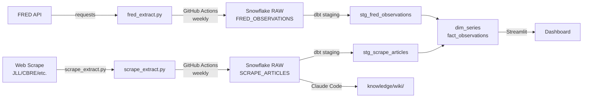

# Milestone 01: Extract & Load — Implementation Plan

> **For agentic workers:** REQUIRED SUB-SKILL: Use superpowers:subagent-driven-development (recommended) or superpowers:executing-plans to implement this plan task-by-task. Steps use checkbox (`- [ ]`) syntax for tracking.

**Goal:** Both data sources extracted and loaded to Snowflake raw. GitHub Actions automating each pipeline. Pipeline diagram in README. Due Apr 27.

**Requirements source:** `docs/project-reqs.md` (Milestone 01 section)

---

## What's Done

- [x] **Source 1 (FRED API) extractor** — `extractors/fred_extract.py` pulls 6 series, loads to `RAW.FRED_OBSERVATIONS` (5,183 rows)
- [x] **Snowflake raw table** — `OPERATIONS_ANALYST.RAW.FRED_OBSERVATIONS` exists and populated

---

## What's Still Needed (all due Apr 27)

| # | Deliverable | Pts | Status |
|---|---|---|---|
| Source 1 GitHub Actions | Automated pipeline for FRED extractor | part of 5 | ❌ |
| Source 2 extractor | Web scrape → Snowflake raw | 10 | ❌ |
| Source 2 GitHub Actions | Automated pipeline for scrape | part of 5 | ❌ |
| Pipeline diagram | In README, all layers labeled | 5 | ❌ |

---

## Task 1: GitHub Actions — Source 1 (FRED)

**Files:**
- Create: `.github/workflows/fred_pipeline.yml`
- Create: `extractors/requirements.txt` (if not already committed)

- [ ] **Step 1: Confirm `extractors/requirements.txt` exists and has correct deps**

```
requests==2.31.0
pandas==2.1.0
snowflake-connector-python==3.6.0
python-dotenv==1.0.0
```

- [ ] **Step 2: Add GitHub Actions secrets**

In your GitHub repo: **Settings → Secrets and variables → Actions → New repository secret**

Add each:
- `FRED_API_KEY`
- `SNOWFLAKE_ACCOUNT`
- `SNOWFLAKE_USER`
- `SNOWFLAKE_PASSWORD`
- `SNOWFLAKE_DATABASE`
- `SNOWFLAKE_WAREHOUSE`

- [ ] **Step 3: Create `.github/workflows/fred_pipeline.yml`**

```yaml
name: FRED Extract & Load

on:
  schedule:
    - cron: '0 6 * * 1'  # Every Monday at 6am UTC
  workflow_dispatch:

jobs:
  extract-load:
    runs-on: ubuntu-latest
    steps:
      - uses: actions/checkout@v4
      - uses: actions/setup-python@v5
        with:
          python-version: '3.11'
      - name: Install dependencies
        run: pip install -r extractors/requirements.txt
      - name: Run FRED extractor
        env:
          FRED_API_KEY: ${{ secrets.FRED_API_KEY }}
          SNOWFLAKE_ACCOUNT: ${{ secrets.SNOWFLAKE_ACCOUNT }}
          SNOWFLAKE_USER: ${{ secrets.SNOWFLAKE_USER }}
          SNOWFLAKE_PASSWORD: ${{ secrets.SNOWFLAKE_PASSWORD }}
          SNOWFLAKE_DATABASE: ${{ secrets.SNOWFLAKE_DATABASE }}
          SNOWFLAKE_WAREHOUSE: ${{ secrets.SNOWFLAKE_WAREHOUSE }}
        run: python extractors/fred_extract.py
```

- [ ] **Step 4: Push and trigger manually to verify**

Go to **Actions → FRED Extract & Load → Run workflow**. Watch logs — all steps should pass.

- [ ] **Step 5: Commit**

```bash
git add .github/workflows/fred_pipeline.yml extractors/requirements.txt
git commit -m "feat: add GitHub Actions pipeline for FRED extract & load"
git push
```

---

## Task 2: Source 2 — Web Scrape Extractor

**Goal:** Scrape CRE industry content and load raw text/data to Snowflake. This feeds both the knowledge base AND a second Snowflake raw table.

**Recommended source:** JLL Research, CBRE, CoStar, or Bisnow (pick one with consistent URLs).

**Files:**
- Create: `extractors/scrape_extract.py`
- Modify: `extractors/requirements.txt` (add scraping deps)

- [ ] **Step 1: Decide on scrape target and table design**

Pick one site with accessible URLs (no login required). Decide what columns you'll store:
- Recommended: `SOURCE_URL`, `TITLE`, `PUBLISHED_DATE`, `CONTENT_TEXT`, `SCRAPED_AT`
- Table name: `RAW.SCRAPE_ARTICLES` (or similar)

- [ ] **Step 2: Add scraping deps to `extractors/requirements.txt`**

Options:
- `firecrawl-py` (if using Firecrawl MCP/API)
- `requests` + `beautifulsoup4` (manual scrape)
- `playwright` (if JS-rendered pages)

- [ ] **Step 3: Write `extractors/scrape_extract.py`**

Pattern:
1. Define list of URLs or a seed URL to crawl
2. Fetch and parse each page
3. Extract: title, date, body text
4. Build DataFrame
5. Load to `RAW.SCRAPE_ARTICLES` via `write_pandas`

- [ ] **Step 4: Run locally to verify**

```bash
python extractors/scrape_extract.py
```

Check Snowflake: `SELECT COUNT(*) FROM RAW.SCRAPE_ARTICLES;`

- [ ] **Step 5: Commit**

```bash
git add extractors/scrape_extract.py extractors/requirements.txt
git commit -m "feat: add web scrape extractor, loads to RAW.SCRAPE_ARTICLES"
```

---

## Task 3: GitHub Actions — Source 2 (Scrape)

**Files:**
- Create: `.github/workflows/scrape_pipeline.yml`

- [ ] **Step 1: Add any new secrets** (e.g., `FIRECRAWL_API_KEY` if using Firecrawl)

- [ ] **Step 2: Create `.github/workflows/scrape_pipeline.yml`**

```yaml
name: Scrape Extract & Load

on:
  schedule:
    - cron: '0 7 * * 1'  # Every Monday at 7am UTC (offset from FRED)
  workflow_dispatch:

jobs:
  extract-load:
    runs-on: ubuntu-latest
    steps:
      - uses: actions/checkout@v4
      - uses: actions/setup-python@v5
        with:
          python-version: '3.11'
      - name: Install dependencies
        run: pip install -r extractors/requirements.txt
      - name: Run scrape extractor
        env:
          SNOWFLAKE_ACCOUNT: ${{ secrets.SNOWFLAKE_ACCOUNT }}
          SNOWFLAKE_USER: ${{ secrets.SNOWFLAKE_USER }}
          SNOWFLAKE_PASSWORD: ${{ secrets.SNOWFLAKE_PASSWORD }}
          SNOWFLAKE_DATABASE: ${{ secrets.SNOWFLAKE_DATABASE }}
          SNOWFLAKE_WAREHOUSE: ${{ secrets.SNOWFLAKE_WAREHOUSE }}
          # Add scrape API key secret here if needed
        run: python extractors/scrape_extract.py
```

- [ ] **Step 3: Push and trigger manually to verify**

- [ ] **Step 4: Commit**

```bash
git add .github/workflows/scrape_pipeline.yml
git commit -m "feat: add GitHub Actions pipeline for scrape extract & load"
git push
```

---

## Task 4: Pipeline Diagram in README

**Files:**
- Modify: `README.md`

- [ ] **Step 1: Add a Pipeline section to README with this Mermaid diagram**

```markdown
## Pipeline


```

Update tool names to match what you actually used.

- [ ] **Step 2: Commit**

```bash
git add README.md
git commit -m "docs: add pipeline diagram to README"
git push
```

---

## Milestone 01 Checklist (submit by Apr 27)

- [ ] Source 1 (FRED) loads to Snowflake raw
- [ ] Source 2 (scrape) loads to Snowflake raw
- [ ] Both pipelines automated via GitHub Actions (or manual trigger)
- [ ] Pipeline diagram in README
- [ ] Repo URL submitted to Brightspace

**dbt, Streamlit, knowledge base, slides, ERD → all Milestone 02 (May 4)**
