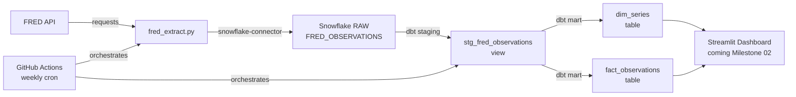

# FRED Pipeline Implementation Plan

> **For agentic workers:** REQUIRED SUB-SKILL: Use superpowers:subagent-driven-development (recommended) or superpowers:executing-plans to implement this plan task-by-task. Steps use checkbox (`- [ ]`) syntax for tracking.

**Goal:** Extract 5 FRED economic series into Snowflake raw, transform through dbt staging and mart layers, and automate via GitHub Actions.

**Architecture:** `fred_extract.py` loops over 5 series IDs → calls FRED REST API → builds pandas DataFrame → loads to `RAW.FRED_OBSERVATIONS` in Snowflake → dbt transforms to `stg_fred_observations` (staging view) → `dim_series` + `fact_observations` (mart tables, star schema) → GitHub Actions runs the full pipeline on a weekly schedule.

**Tech Stack:** Python 3, `requests`, `pandas`, `snowflake-connector-python`, `python-dotenv`, `dbt-snowflake`, GitHub Actions

---

## File Map

| File | What it does |
|---|---|
| `extractors/fred_extract.py` | Pulls FRED API, loads to Snowflake raw |
| `extractors/requirements.txt` | Python dependencies for extractor |
| `.env` | Local secrets — never committed |
| `dbt/dbt_project.yml` | dbt project config |
| `dbt/profiles.yml` | Snowflake connection using env vars |
| `dbt/models/staging/sources.yml` | Declares RAW.FRED_OBSERVATIONS as a dbt source |
| `dbt/models/staging/stg_fred_observations.sql` | Cleans and casts raw observations |
| `dbt/models/staging/stg_fred_observations.yml` | dbt tests for staging model |
| `dbt/models/mart/dim_series.sql` | One row per FRED series (dimension table) |
| `dbt/models/mart/fact_observations.sql` | One row per series per date (fact table) |
| `dbt/models/mart/mart.yml` | dbt tests for mart models |
| `.github/workflows/fred_pipeline.yml` | GitHub Actions workflow |
| `README.md` | Add pipeline diagram (Mermaid) |

---

## Task 1: Set Up Python Environment

**Files:**
- Create: `extractors/requirements.txt`
- Create: `.env`

- [ ] **Step 1: Create `extractors/requirements.txt`**

```
requests==2.31.0
pandas==2.1.0
snowflake-connector-python==3.6.0
python-dotenv==1.0.0
pytest==7.4.0
```

- [ ] **Step 2: Create `.env` in project root**

```
FRED_API_KEY=your_fred_key_here
SNOWFLAKE_ACCOUNT=your_account_here
SNOWFLAKE_USER=your_user_here
SNOWFLAKE_PASSWORD=your_password_here
SNOWFLAKE_DATABASE=your_database_here
SNOWFLAKE_WAREHOUSE=your_warehouse_here
```

Replace each value with your actual credentials. This file is already in `.gitignore` — never commit it.

- [ ] **Step 3: Install dependencies**

```bash
pip install -r extractors/requirements.txt
```

Expected: packages install without errors.

- [ ] **Step 4: Verify `.env` is gitignored**

```bash
git status
```

Expected: `.env` does NOT appear in untracked files. If it does, add it to `.gitignore` now.

- [ ] **Step 5: Commit requirements**

```bash
git add extractors/requirements.txt
git commit -m "feat: add extractor dependencies"
```

---

## Task 2: Write the FRED Extractor

**Files:**
- Create: `extractors/fred_extract.py`
- Create: `tests/test_fred_extract.py`

- [ ] **Step 1: Create `tests/test_fred_extract.py` with a failing test**

```python
from unittest.mock import patch, MagicMock
import pandas as pd
import sys
import os

sys.path.insert(0, os.path.join(os.path.dirname(__file__), '..', 'extractors'))


def test_fetch_observations_returns_dataframe():
    mock_response = MagicMock()
    mock_response.status_code = 200
    mock_response.json.return_value = {
        "observations": [
            {"date": "2023-01-01", "value": "213.45"},
            {"date": "2023-04-01", "value": "215.00"},
        ]
    }

    with patch("requests.get", return_value=mock_response):
        from fred_extract import fetch_observations
        result = fetch_observations("COMREAINTUSQ159N", "fake_key")

    assert isinstance(result, pd.DataFrame)
    assert list(result.columns) == ["series_id", "date", "value"]
    assert len(result) == 2
    assert result["series_id"].iloc[0] == "COMREAINTUSQ159N"
```

- [ ] **Step 2: Run test to verify it fails**

```bash
pytest tests/test_fred_extract.py -v
```

Expected: `ImportError` or `ModuleNotFoundError` — `fred_extract` doesn't exist yet.

- [ ] **Step 3: Create `extractors/fred_extract.py` with the `fetch_observations` function**

```python
import requests
import pandas as pd
import os
from dotenv import load_dotenv

load_dotenv()

FRED_API_KEY = os.getenv("FRED_API_KEY")
BASE_URL = "https://api.stlouisfed.org/fred/series/observations"

SERIES_IDS = [
    "COMREAINTUSQ159N",
    "MORTGAGE30US",
    "UNRATE",
    "HOUST",
    "CPIAUCSL",
]


def fetch_observations(series_id: str, api_key: str) -> pd.DataFrame:
    params = {
        "series_id": series_id,
        "api_key": api_key,
        "file_type": "json",
    }
    response = requests.get(BASE_URL, params=params)
    data = response.json()

    rows = []
    for obs in data["observations"]:
        rows.append({
            "series_id": series_id,
            "date": obs["date"],
            "value": obs["value"],
        })

    return pd.DataFrame(rows, columns=["series_id", "date", "value"])
```

- [ ] **Step 4: Run test to verify it passes**

```bash
pytest tests/test_fred_extract.py -v
```

Expected: `PASSED`

- [ ] **Step 5: Commit**

```bash
git add extractors/fred_extract.py tests/test_fred_extract.py
git commit -m "feat: add FRED fetch_observations function with test"
```

---

## Task 3: Add Snowflake Load to Extractor

**Files:**
- Modify: `extractors/fred_extract.py`
- Modify: `tests/test_fred_extract.py`

- [ ] **Step 1: Add a failing test for the load function**

Add to `tests/test_fred_extract.py`:

```python
def test_load_to_snowflake_calls_write_pandas():
    import pandas as pd
    from unittest.mock import patch, MagicMock

    df = pd.DataFrame([
        {"series_id": "UNRATE", "date": "2023-01-01", "value": "3.4"}
    ])

    mock_conn = MagicMock()

    with patch("snowflake.connector.connect", return_value=mock_conn), \
         patch("snowflake.connector.pandas_tools.write_pandas") as mock_write:

        from fred_extract import load_to_snowflake
        load_to_snowflake(df)

        mock_write.assert_called_once()
        call_args = mock_write.call_args
        assert call_args[0][2] == "FRED_OBSERVATIONS"
```

- [ ] **Step 2: Run test to verify it fails**

```bash
pytest tests/test_fred_extract.py::test_load_to_snowflake_calls_write_pandas -v
```

Expected: `ImportError` — `load_to_snowflake` not defined yet.

- [ ] **Step 3: Replace `extractors/fred_extract.py` with the full updated version (imports must stay at the top)**

Full contents of `extractors/fred_extract.py`:

```python
import os
import requests
import pandas as pd
import snowflake.connector
from snowflake.connector.pandas_tools import write_pandas
from dotenv import load_dotenv

load_dotenv()

FRED_API_KEY = os.getenv("FRED_API_KEY")
BASE_URL = "https://api.stlouisfed.org/fred/series/observations"

SERIES_IDS = [
    "COMREAINTUSQ159N",
    "MORTGAGE30US",
    "UNRATE",
    "HOUST",
    "CPIAUCSL",
]


def fetch_observations(series_id: str, api_key: str) -> pd.DataFrame:
    params = {
        "series_id": series_id,
        "api_key": api_key,
        "file_type": "json",
    }
    response = requests.get(BASE_URL, params=params)
    data = response.json()

    rows = []
    for obs in data["observations"]:
        rows.append({
            "series_id": series_id,
            "date": obs["date"],
            "value": obs["value"],
        })

    return pd.DataFrame(rows, columns=["series_id", "date", "value"])


def load_to_snowflake(df: pd.DataFrame) -> None:
    conn = snowflake.connector.connect(
        account=os.getenv("SNOWFLAKE_ACCOUNT"),
        user=os.getenv("SNOWFLAKE_USER"),
        password=os.getenv("SNOWFLAKE_PASSWORD"),
        database=os.getenv("SNOWFLAKE_DATABASE"),
        warehouse=os.getenv("SNOWFLAKE_WAREHOUSE"),
        schema="RAW",
    )

    conn.cursor().execute("CREATE SCHEMA IF NOT EXISTS RAW")
    conn.cursor().execute("""
        CREATE TABLE IF NOT EXISTS RAW.FRED_OBSERVATIONS (
            SERIES_ID VARCHAR,
            DATE VARCHAR,
            VALUE VARCHAR,
            LOADED_AT TIMESTAMP DEFAULT CURRENT_TIMESTAMP
        )
    """)

    df.columns = [c.upper() for c in df.columns]
    write_pandas(conn, df, "FRED_OBSERVATIONS", auto_create_table=False)
    conn.close()
    print(f"Loaded {len(df)} rows to RAW.FRED_OBSERVATIONS")


def main():
    all_results = []

    for series_id in SERIES_IDS:
        print(f"Fetching {series_id}...")
        df = fetch_observations(series_id, FRED_API_KEY)
        all_results.append(df)
        print(f"  Got {len(df)} rows")

    combined = pd.concat(all_results, ignore_index=True)
    print(f"Total rows: {len(combined)}")
    load_to_snowflake(combined)


if __name__ == "__main__":
    main()
```

- [ ] **Step 4: Run all tests**

```bash
pytest tests/test_fred_extract.py -v
```

Expected: all tests `PASSED`

- [ ] **Step 5: Run the script locally to verify end-to-end**

```bash
python extractors/fred_extract.py
```

Expected output (roughly):
```
Fetching COMREAINTUSQ159N...
  Got 100 rows
Fetching MORTGAGE30US...
  Got 2700 rows
...
Total rows: 5400
Loaded 5400 rows to RAW.FRED_OBSERVATIONS
```

Check Snowflake: log in and run `SELECT COUNT(*) FROM RAW.FRED_OBSERVATIONS;` — should match.

- [ ] **Step 6: Commit**

```bash
git add extractors/fred_extract.py tests/test_fred_extract.py
git commit -m "feat: add Snowflake load to extractor, end-to-end pipeline working"
```

---

## Task 4: Set Up dbt Project

**Files:**
- Create: `dbt/dbt_project.yml`
- Create: `dbt/profiles.yml`

- [ ] **Step 1: Install dbt**

```bash
pip install dbt-snowflake
```

Expected: installs without errors. Run `dbt --version` to confirm.

- [ ] **Step 2: Create `dbt/dbt_project.yml`**

```yaml
name: 'fred_pipeline'
version: '1.0.0'
config-version: 2

profile: 'fred_pipeline'

model-paths: ["models"]
test-paths: ["tests"]
macro-paths: ["macros"]

target-path: "target"
clean-targets:
  - "target"
  - "dbt_packages"

models:
  fred_pipeline:
    staging:
      +materialized: view
    mart:
      +materialized: table
```

- [ ] **Step 3: Create `dbt/profiles.yml`**

```yaml
fred_pipeline:
  target: dev
  outputs:
    dev:
      type: snowflake
      account: "{{ env_var('SNOWFLAKE_ACCOUNT') }}"
      user: "{{ env_var('SNOWFLAKE_USER') }}"
      password: "{{ env_var('SNOWFLAKE_PASSWORD') }}"
      database: "{{ env_var('SNOWFLAKE_DATABASE') }}"
      warehouse: "{{ env_var('SNOWFLAKE_WAREHOUSE') }}"
      schema: STAGING
      threads: 1
      client_session_keep_alive: false
```

- [ ] **Step 4: Create directory structure**

```bash
mkdir -p dbt/models/staging dbt/models/mart dbt/macros dbt/tests
```

- [ ] **Step 5: Test dbt connection**

```bash
cd dbt && dbt debug --profiles-dir .
```

Expected: `All checks passed!`

- [ ] **Step 6: Commit**

```bash
git add dbt/
git commit -m "feat: initialize dbt project with Snowflake profile"
```

---

## Task 5: Write Staging Model

**Files:**
- Create: `dbt/models/staging/sources.yml`
- Create: `dbt/models/staging/stg_fred_observations.sql`
- Create: `dbt/models/staging/stg_fred_observations.yml`

- [ ] **Step 1: Create `dbt/models/staging/sources.yml`**

```yaml
version: 2

sources:
  - name: raw
    database: "{{ env_var('SNOWFLAKE_DATABASE') }}"
    schema: RAW
    tables:
      - name: fred_observations
```

- [ ] **Step 2: Create `dbt/models/staging/stg_fred_observations.sql`**

```sql
with source as (
    select * from {{ source('raw', 'fred_observations') }}
),

cleaned as (
    select
        series_id,
        to_date(date) as observation_date,
        try_to_double(value) as value,
        loaded_at
    from source
    where value != '.'
)

select * from cleaned
```

FRED uses `'.'` for missing values — the `where value != '.'` filter removes them before casting.

- [ ] **Step 3: Create `dbt/models/staging/stg_fred_observations.yml`**

```yaml
version: 2

models:
  - name: stg_fred_observations
    description: "Cleaned FRED economic observations. One row per series per date."
    columns:
      - name: series_id
        description: "FRED series identifier"
        tests:
          - not_null
      - name: observation_date
        description: "Date of the observation"
        tests:
          - not_null
      - name: value
        description: "Numeric value of the observation"
        tests:
          - not_null
```

- [ ] **Step 4: Run the staging model**

```bash
cd dbt && dbt run --select stg_fred_observations --profiles-dir .
```

Expected: `1 of 1 OK created sql view model STAGING.stg_fred_observations`

- [ ] **Step 5: Run staging tests**

```bash
cd dbt && dbt test --select stg_fred_observations --profiles-dir .
```

Expected: all tests pass.

- [ ] **Step 6: Commit**

```bash
git add dbt/models/staging/
git commit -m "feat: add dbt staging model for FRED observations"
```

---

## Task 6: Write Mart Models (Star Schema)

**Files:**
- Create: `dbt/models/mart/dim_series.sql`
- Create: `dbt/models/mart/fact_observations.sql`
- Create: `dbt/models/mart/mart.yml`

- [ ] **Step 1: Create `dbt/models/mart/dim_series.sql`**

```sql
with series as (
    select distinct series_id
    from {{ ref('stg_fred_observations') }}
)

select
    series_id,
    case series_id
        when 'COMREAINTUSQ159N' then 'Commercial Real Estate Price Index'
        when 'MORTGAGE30US'     then '30-Year Fixed Mortgage Rate'
        when 'UNRATE'           then 'Unemployment Rate'
        when 'HOUST'            then 'Housing Starts'
        when 'CPIAUCSL'         then 'Consumer Price Index'
    end as series_name,
    case series_id
        when 'COMREAINTUSQ159N' then 'Index 2000=100'
        when 'MORTGAGE30US'     then 'Percent'
        when 'UNRATE'           then 'Percent'
        when 'HOUST'            then 'Thousands of Units'
        when 'CPIAUCSL'         then 'Index 1982-84=100'
    end as units,
    case series_id
        when 'COMREAINTUSQ159N' then 'Quarterly'
        when 'MORTGAGE30US'     then 'Weekly'
        when 'UNRATE'           then 'Monthly'
        when 'HOUST'            then 'Monthly'
        when 'CPIAUCSL'         then 'Monthly'
    end as frequency,
    'Commercial Real Estate' as category
from series
```

- [ ] **Step 2: Create `dbt/models/mart/fact_observations.sql`**

```sql
select
    obs.series_id,
    obs.observation_date,
    obs.value,
    obs.loaded_at
from {{ ref('stg_fred_observations') }} obs
inner join {{ ref('dim_series') }} dim
    on obs.series_id = dim.series_id
```

- [ ] **Step 3: Create `dbt/models/mart/mart.yml`**

```yaml
version: 2

models:
  - name: dim_series
    description: "One row per FRED series. Dimension table."
    columns:
      - name: series_id
        description: "FRED series identifier — primary key"
        tests:
          - not_null
          - unique
      - name: series_name
        tests:
          - not_null
      - name: frequency
        tests:
          - not_null

  - name: fact_observations
    description: "One row per series per date. Fact table."
    columns:
      - name: series_id
        description: "Foreign key to dim_series"
        tests:
          - not_null
      - name: observation_date
        tests:
          - not_null
      - name: value
        tests:
          - not_null
```

- [ ] **Step 4: Run all mart models**

```bash
cd dbt && dbt run --select mart.* --profiles-dir .
```

Expected:
```
1 of 2 OK created sql table model STAGING.dim_series
2 of 2 OK created sql table model STAGING.fact_observations
```

- [ ] **Step 5: Run all dbt tests**

```bash
cd dbt && dbt test --profiles-dir .
```

Expected: all tests pass (not_null + unique on dim_series.series_id at minimum).

- [ ] **Step 6: Commit**

```bash
git add dbt/models/mart/
git commit -m "feat: add dbt mart models — dim_series and fact_observations star schema"
```

---

## Task 7: Set Up GitHub Actions Pipeline

**Files:**
- Create: `.github/workflows/fred_pipeline.yml`

- [ ] **Step 1: Add GitHub Actions secrets**

In your GitHub repo, go to **Settings → Secrets and variables → Actions → New repository secret**.

Add each of these secrets:
- `FRED_API_KEY`
- `SNOWFLAKE_ACCOUNT`
- `SNOWFLAKE_USER`
- `SNOWFLAKE_PASSWORD`
- `SNOWFLAKE_DATABASE`
- `SNOWFLAKE_WAREHOUSE`

Values come from your `.env` file. Never paste these anywhere else in the repo.

- [ ] **Step 2: Create `.github/workflows/fred_pipeline.yml`**

```yaml
name: FRED Pipeline

on:
  schedule:
    - cron: '0 6 * * 1'  # Every Monday at 6am UTC
  workflow_dispatch:      # Also allows manual trigger from GitHub UI

jobs:
  extract-load-transform:
    runs-on: ubuntu-latest

    steps:
      - name: Checkout repo
        uses: actions/checkout@v4

      - name: Set up Python
        uses: actions/setup-python@v5
        with:
          python-version: '3.11'

      - name: Install extractor dependencies
        run: pip install -r extractors/requirements.txt

      - name: Run FRED extractor
        env:
          FRED_API_KEY: ${{ secrets.FRED_API_KEY }}
          SNOWFLAKE_ACCOUNT: ${{ secrets.SNOWFLAKE_ACCOUNT }}
          SNOWFLAKE_USER: ${{ secrets.SNOWFLAKE_USER }}
          SNOWFLAKE_PASSWORD: ${{ secrets.SNOWFLAKE_PASSWORD }}
          SNOWFLAKE_DATABASE: ${{ secrets.SNOWFLAKE_DATABASE }}
          SNOWFLAKE_WAREHOUSE: ${{ secrets.SNOWFLAKE_WAREHOUSE }}
        run: python extractors/fred_extract.py

      - name: Install dbt
        run: pip install dbt-snowflake

      - name: Run dbt
        env:
          SNOWFLAKE_ACCOUNT: ${{ secrets.SNOWFLAKE_ACCOUNT }}
          SNOWFLAKE_USER: ${{ secrets.SNOWFLAKE_USER }}
          SNOWFLAKE_PASSWORD: ${{ secrets.SNOWFLAKE_PASSWORD }}
          SNOWFLAKE_DATABASE: ${{ secrets.SNOWFLAKE_DATABASE }}
          SNOWFLAKE_WAREHOUSE: ${{ secrets.SNOWFLAKE_WAREHOUSE }}
        run: |
          cd dbt
          dbt run --profiles-dir .
          dbt test --profiles-dir .
```

- [ ] **Step 3: Commit and push**

```bash
git add .github/workflows/fred_pipeline.yml
git commit -m "feat: add GitHub Actions pipeline for FRED extract-load-transform"
git push
```

- [ ] **Step 4: Trigger the workflow manually to verify**

On GitHub, go to **Actions → FRED Pipeline → Run workflow**. Watch the logs. All steps should pass.

---

## Task 8: Add Pipeline Diagram to README

**Files:**
- Modify: `README.md`

- [ ] **Step 1: Add the following Mermaid diagram to `README.md`**

Add a "Pipeline" section with this content:

```markdown
## Pipeline


```

- [ ] **Step 2: Commit**

```bash
git add README.md
git commit -m "docs: add pipeline diagram to README"
git push
```
