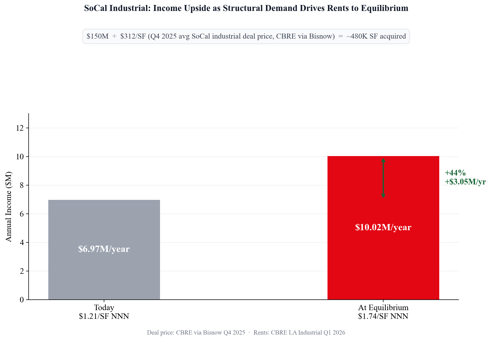

# Stakeholder Brief — SoCal Industrial Investment Recommendation

---

## The Stakeholder

**A private equity fund with LA commercial real estate exposure.**

Private capital drove 61.4% of all LA CRE deals in 2025 — the highest share in a decade — and is net buying across the market. These funds move on conviction before institutional investors act. A typical LA-focused PE fund holds a mix of property types, likely including office, and faces two questions right now: what to do with underperforming positions, and where to redeploy capital.

We chose this stakeholder because our data directly answers both questions. The office-to-industrial rotation story is supported by both Snowflake API data (REIT prices, FRED macro, BLS employment) and the wiki (synthesized from CBRE, Cushman & Wakefield, JLL, and Bisnow primary reports). The API data quantifies the divergence in prices and employment; the wiki grounds it in primary market research. Together they make the recommendation defensible in a client meeting.

Source: `knowledge/wiki/capital-markets.md` — Bisnow LA capital markets, CBRE via Bisnow Q4 2025

---

## Descriptive — What Is Happening

*Slide title: "A Sharp Divergence in Investor Capital: Industrial +160% vs. Office −36% Since 2018"*

The LA CRE market has split in two.

| Metric | Office | Industrial |
|---|---|---|
| Vacancy (Q1 2026) | 23.6% | 5.4% |
| YTD Net Absorption | −1.1M SF | +934K SF (first positive since 2022) |
| REIT price since 2018 | Down ~36% | Up ~160% |
| Asking rent | $3.62/SF FSG | $1.21/SF NNN (−30.5% from 2023 peak) |

LA West — the lone office bright spot through Q2 2025 (+264K SF) — turned sharply negative in Q1 2026 at −545K SF. The decline is no longer concentrated in distressed submarkets; it has broadened to the Westside.

**Stat verification:** +160% / −36% calculated from `FACT_DAILY_PRICES` — quarterly average office and industrial REIT close prices indexed to Q1 2018 baseline. Live from yfinance via Snowflake.

Sources: Cushman & Wakefield LA Office Q1 2026 · CBRE LA Industrial Q1 2026 · `FACT_DAILY_PRICES` (yfinance via Snowflake)

---

## Diagnostic — Why It Is Happening

*Slide titles:*
- *"E-Commerce Share of Retail Rose ~4 Percentage Points in 2020 and Held — Permanently Shifting Industrial Demand"*
- *"Office Underperformance Persists Beyond the Rate Shock, Signaling Structural Weakness (−21% YoY REIT Price Decline, Q1 2026)"*

Two structural shifts — not a single rate cycle — explain the divergence.

**Office:** The 2022–2023 Fed rate hike cycle (0% → 5.33%) accelerated valuation declines. Rates have since eased and office has not recovered — office REIT prices fell −21% YoY in Q1 2026 even as rates eased. That persistence points to structural demand loss: hybrid work permanently reduced office-using employment. LA's Financial Activities and Professional Services sectors shed jobs YoY in 2025 while peer cities like Dallas grew 20%. When the demand driver — employees in offices — isn't growing, leasing doesn't recover regardless of what the Fed does.

**Stat verification:** −21% YoY calculated directly from `FACT_DAILY_PRICES` — average office REIT close price Q1 2026 ($43.30) vs. Q1 2025 ($54.82) = −21.0%. Verified via Snowflake query.

**Industrial:** E-commerce share of retail sales rose ~4 percentage points in 2020 (from ~11% to ~15.5%) and has held above pre-COVID levels since. That permanent shift in how goods move created durable warehouse demand. A temporary spec oversupply (2020–2022) pushed vacancy up and rents 30.5% below peak — but the correction is clearing. Absorption turned positive. The construction pipeline has contracted −34.5% YOY for four consecutive quarters.

**Stat verification:** E-commerce share (FRED ECOMPCTNSA) pulled from `FACT_MACRO_QUARTERLY` — Q1 2020: 11.7%, Q2 2020: 15.5%, sustained 13–16% through 2021+. Verified via Snowflake query.

**Evidence from Wiki Sources Supporting the Divergence:**

- **Office — recovery narrowing to Class A only:** Trophy and best-in-class assets are holding demand while commodity office faces rising vacancy. 1950 Avenue of the Stars in Century City is 90%+ pre-leased while DTLA sits at 32% vacancy. JLL, Cushman & Wakefield, and Bisnow all confirm the same bifurcation — demand is concentrating in best-in-class space, not recovering market-wide. Source: `knowledge/wiki/la-office-market.md`

- **Industrial — large-format demand is back:** Big-box leasing (500K+ SF) surged +80.7% YOY in Q1 2026 nationally, reversing the cautious approach of 2023–2024. Amazon's 615K SF Commerce deal is the LA manifestation of this trend. Source: `knowledge/wiki/la-industrial-market.md` · `knowledge/wiki/national-cre-trends.md` (JLL US Industrial Q1 2026)

Sources: `knowledge/wiki/la-office-market.md` · `knowledge/wiki/macro-environment.md` · `knowledge/wiki/la-industrial-market.md` · `knowledge/wiki/national-cre-trends.md` · `FACT_MACRO_QUARTERLY` (FRED FEDFUNDS, ECOMPCTNSA)

---

## Action + Predicted Outcome

*Slide title: "Rotate ~$150M into SoCal Industrial: Structural E-Commerce Demand Drives 44% Income Growth as Rents Return to Equilibrium"*

**Recommendation:** For a $750M LA CRE fund (40% office / 25% industrial / 35% other) — reduce office from 40% → 20% and redeploy ~$150M into SoCal industrial.

*Assumes $750M fund, 40/25/35 allocation — stated assumption, adjust for actual client.*

**Why exit office:** The structural decline is confirmed. Vacancy is rising and absorption remains negative even as rates ease. Waiting for a rate-driven recovery is the wrong thesis — the driver is hybrid work, not the Fed.

---

**Conclusion — Industrial is structurally strong:**

E-commerce share of retail rose from ~11% to ~16% in 2020 and has held there. That permanent shift in how goods move created a durable, growing base of warehouse demand that does not depend on the rate cycle. Industrial REIT prices are up ~160% since 2018 — institutional investors have already validated this thesis in public markets. Big-box leasing (500K+ SF) surged +80.7% YOY in Q1 2026, confirming large-format tenant demand is back. This is a structural shift, not a cycle.

Sources: `FACT_DAILY_PRICES` (yfinance) · `FACT_MACRO_QUARTERLY` (FRED ECOMPCTNSA) · `knowledge/wiki/la-industrial-market.md` (JLL US Industrial Q1 2026)

---

**Prediction — Rents will rise as structural demand reasserts:**

With e-commerce demand sustained and the structural case intact, industrial space is in durable demand. As supply tightens, vacancy falls, and landlords regain pricing power, rents rise. The prior equilibrium — where structural demand and supply were in balance — was $1.74/SF NNN. As structural demand reasserts, rents return to and potentially past that level.

| | Value | Source |
|---|---|---|
| Current asking rent | $1.21/SF NNN | CBRE Q1 2026 |
| Structural equilibrium rent (2023) | $1.74/SF NNN | CBRE Q1 2026 |
| Avg deal price Q4 2025 | $312/SF | CBRE via Bisnow |
| SF acquired at $312/SF | ~480,000 SF (2–3 assets) | — |
| Annual income today | $6.97M/year | — |
| Annual income at equilibrium rent | $10.02M/year | — |
| **Predicted income upside** | **+44% (+$3.05M/year)** | **($1.74 − $1.21) / $1.21** |

---

**Note — Why rents are below equilibrium today, and why that makes now the right time to act:**

A spec oversupply cycle (2020–2022) temporarily flooded the market with more space than tenants could absorb, pushing rents from $1.74/SF to $1.21/SF. Structural demand never went away — it was masked by excess supply. That oversupply is now clearing: absorption turned positive Q1 2026 (first since 2022), pipeline contracted −34.5% YOY for four consecutive quarters. The result: you can buy into a structurally strong asset class at below-equilibrium pricing. When institutional capital re-enters — CBRE projects 2026 — that window closes.

| Signal | Data | What it means |
|---|---|---|
| Absorption | +934K SF Q1 2026 — first positive since 2022 | Structural demand reasserting as oversupply clears |
| Pipeline | −34.5% YOY, four consecutive quarters | Less new supply coming — tightening is durable |
| Buyer composition | Private capital 63.8% of Q4 2025 SoCal industrial deals; institutional 23.8% | Institutional re-entry will compress cap rates and lift asset values |

Sources: `knowledge/wiki/la-industrial-market.md` · `knowledge/wiki/capital-markets.md` · CBRE LA Industrial Q1 2026 · CBRE via Bisnow Q4 2025
